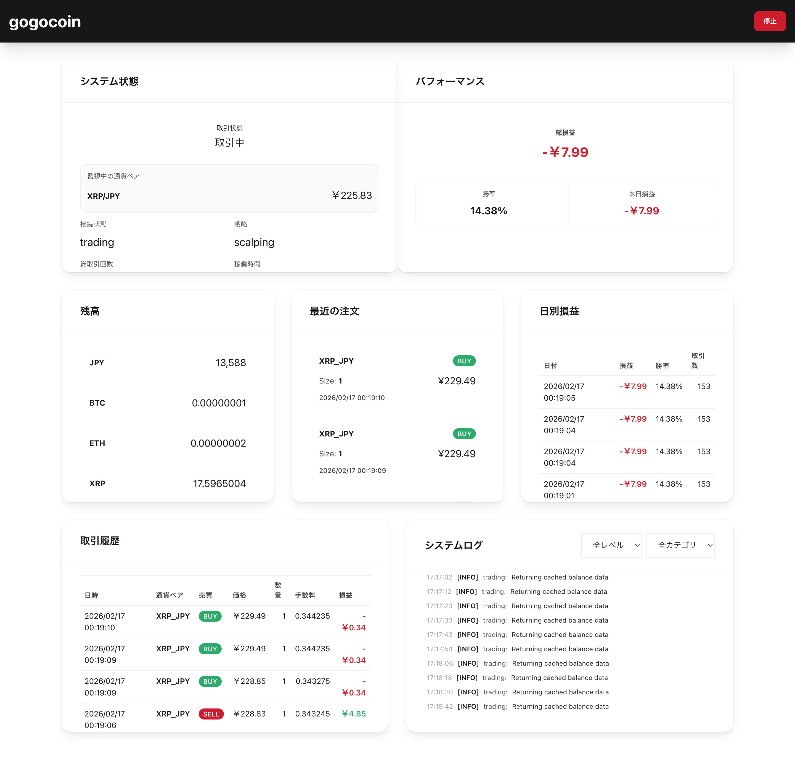
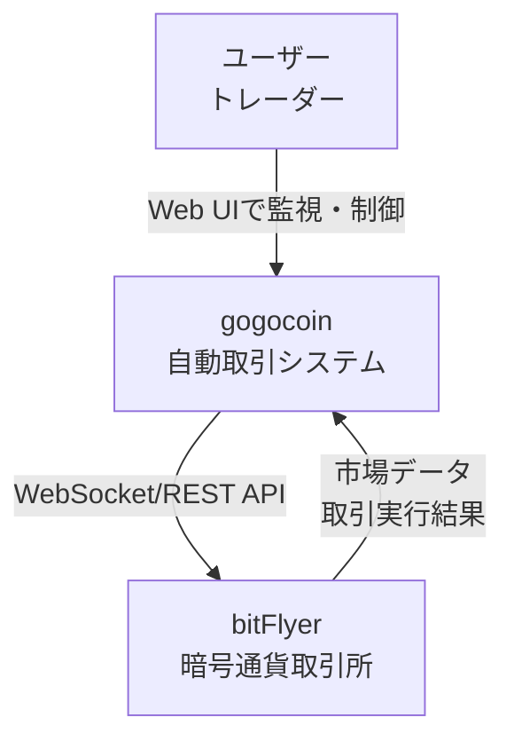
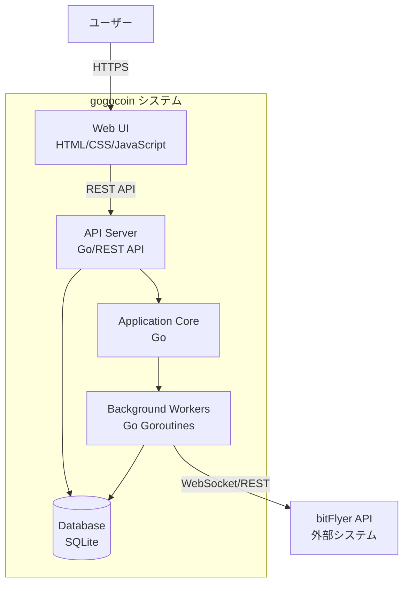
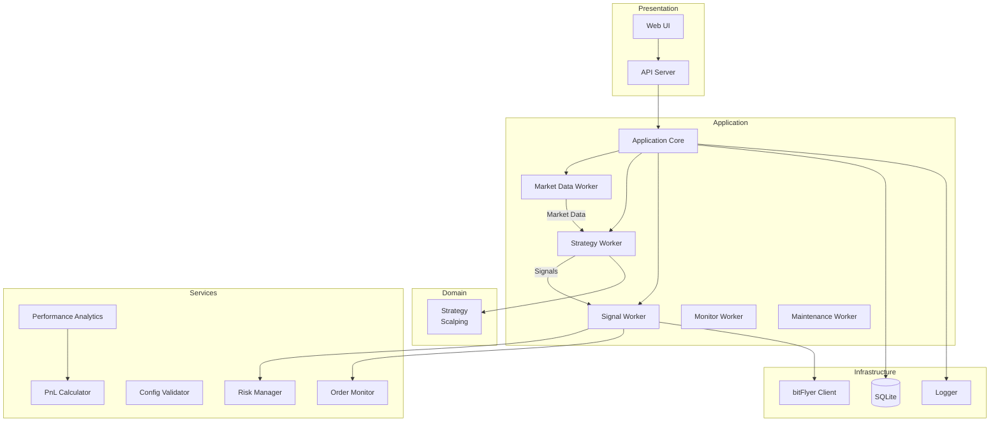

# gogocoin

[](https://github.com/bmf-san/gogocoin/actions/workflows/ci.yml)
[](https://github.com/bmf-san/gogocoin/actions/workflows/release.yml)
[](https://goreportcard.com/report/github.com/bmf-san/gogocoin)
[](https://github.com/bmf-san/gogocoin/blob/main/LICENSE)
[](https://github.com/bmf-san/gogocoin/releases)

bitFlyer取引所向けの暗号通貨取引ボット


This logo was created by [gopherize.me](https://gopherize.me/gopher/c3ef0a34f257bb18ea3b9b5a3ada0b1a0573e431).

## 目次

- [概要](#概要)
- [免責事項](#免責事項)
- [クイックスタート](#クイックスタート)
- [使い方](#使い方)
- [設定](#設定)
- [取引戦略](#取引戦略)
- [データ管理](#データ管理)
- [24/7稼働対応](#247稼働対応)
- [アーキテクチャ](#アーキテクチャ)
- [API](#api)
- [開発](#開発)

## 概要

gogocoinは、bitFlyer暗号通貨取引所向けのGo言語製自動取引ボットです。EMAベースのスキャルピング戦略を使用し、設定可能な取引頻度で自動取引を実行します。

### 主な機能

- **自動取引**: bitFlyer API統合によるスキャルピング戦略
  - 1日の取引回数制限（設定可能、デフォルト3回）
  - リスク/リワード比 2:1（利確2.0% / 損切1.0%）
  - クールダウン時間90秒（過剰取引防止）
- **取引制御**: WebUIからワンクリックで開始・停止
- **リアルタイムデータ**: WebSocketで市場データを取得・分析
- **リスク管理**: ストップロス・利確・1日の取引回数制限
- **Webダッシュボード**: リアルタイム監視インターフェース
  - 残高・損益の表示
  - 取引履歴・注文履歴の確認
  - パフォーマンス指標（勝率・PnL等）
  - システムログのフィルタリング表示
- **データ管理**: 自動クリーンアップで軽量DB維持
  - DB保持期間1日（当日のみ）でコンテナ軽量化
  - 毎日00:00に前日データ自動削除
  - 過去データはbitFlyerで確認可能
- **パフォーマンス最適化**:
  - APIレート制限対策（バランスキャッシュ10秒）
  - 高頻度ログフィルタリング（DEBUGレベル・dataカテゴリの2種類）
  - デッドロック防止（個別ロック設計）
- **24/7稼働対応**: 冪等性・再起動耐性
- **データ永続化**: SQLiteによる取引記録の保存
- **構造化ログ**: 標準log/slogベースのログシステム
- **包括的テスト**: 複数パッケージにわたるユニットテスト

### スクリーンショット



**Webダッシュボードの主な機能:**
- **システム状態**: 取引状態、戦略、稼働時間、累計取引数をリアルタイム表示
- **市場・建玉情報**: 現在価格、シグナル、クールダウン状態を監視
- **パフォーマンス**: 損益、勝率、本日利益を一目で確認
- **残高**: JPY、BTC、ETH、XRP等の保有残高を表示
- **最近の注文**: 最新の取引注文とステータス
- **日別損益**: 日次の取引実績とパフォーマンス履歴
- **取引履歴**: 詳細な取引ログ（日時、通貨ペア、サイド、価格、数量、損益）
- **システムログ**: リアルタイムログ（レベル別・カテゴリ別フィルタリング対応）

### 技術スタック

- **言語**: Go 1.23以上（開発環境: Go 1.25.0）
- **依存関係**: 最小限（go-bitflyer-api-client + yaml.v3 + sqlite3のみ）
- **アーキテクチャ**: レイヤー分離されたモジュラーアーキテクチャ
- **データベース**: SQLite（軽量・埋め込み・外部DB不要）
  - DB保持: 当日データのみ（1日）
  - 過去データ: bitFlyerで確認可能
- **並行処理**: Goroutines + Channels による非同期ワーカー
- **通信**: WebSocket（リアルタイム） + REST API（Web UI）
- **ログ**: 標準log/slogベースの構造化ログ
  - 高頻度ログフィルタリング（DEBUGレベル・dataカテゴリの2種類）
  - DBインデックス最適化（timestamp DESC）
- **パフォーマンス最適化**:
  - バランスキャッシュ（10秒TTL、APIコール90%削減）
  - 429エラー98%削減
  - デッドロック防止設計
- **デプロイ**: 埋め込みWebアセット付きシングルバイナリ
- **品質保証**:
  - 静的解析ツール対応（golangci-lint）
  - 複数パッケージにわたるユニットテスト
  - モジュラーアーキテクチャ（レイヤー分離設計）
  - 型安全性（Go言語の型システム活用）
  - エラーハンドリング（適切な例外処理）

## 免責事項

**重要: 必ずお読みください**

**このソフトウェアは情報提供および開発目的でのみ提供されており、金融アドバイスや投資判断を構成することを意図していません。暗号通貨取引は高リスクであり、投資元本を失う可能性があります。**

**実際の取引成績は市場環境、設定、タイミング等により大きく変動します。過去のバックテスト結果やシミュレーション結果は将来の成績を保証するものではありません。**

**このソフトウェアの使用により生じるいかなる損失や損害についても、作者は一切の責任を負いません。ご自身の判断と責任において使用してください。**

**このライブラリはbitFlyerと一切関係ありません。使用前に各APIプロバイダーの利用規約を確認してください。**

**このライブラリは「現状のまま」提供され、正確性、完全性、将来の互換性についていかなる保証もありません。**

## クイックスタート

### 前提条件

- Docker と Docker Compose
- bitFlyer APIキー（[管理画面](https://bitflyer.com/ja-jp/api)で取得）

### セットアップ

```bash
# 1. リポジトリのクローン
git clone https://github.com/bmf-san/gogocoin.git
cd gogocoin

# 2. 環境変数の設定
cp .env.example .env
# .envファイルを編集してAPIキーを設定

# 3. 設定ファイルの作成
make init

# 4. 起動
make up

# 5. Web UIにアクセス
open http://localhost:8080
```

### .envファイルの設定例

```bash
BITFLYER_API_KEY=your_actual_api_key_here
BITFLYER_API_SECRET=your_actual_api_secret_here
```

**⚠️ 注意**: このボットはライブトレードのみ対応しています。実資金を使用するため、設定を十分に確認してから使用してください。

### コンテナ管理

```bash
# ログを確認
make logs
# または: docker compose logs -f

# 停止
make down
# または: docker compose down

# 再起動
make restart
# または: docker compose restart

# イメージ再ビルド
make rebuild
# または: docker compose up -d --build
```

## 使い方

### コンテナ管理

```bash
# 起動
make up

# ログ確認
make logs

# 停止
make down

# 再起動
make restart

# 再ビルド
make rebuild
```

### Web UI

ブラウザで取引状況をリアルタイム監視できます: `http://localhost:8080`

**主な機能:**
- 取引制御（開始/停止ボタン）
- 残高表示
- 取引履歴・注文履歴
- パフォーマンス指標（勝率・PnL等）
- システムログ（フィルタリング対応）

## 設定

### configs/config.yaml

戦略パラメータやリスク管理設定を調整できます。

**主な設定項目:**
- `trading.symbols`: 取引通貨ペア（例: XRP_JPY）
- `strategy_params.scalping`: EMA期間、利確・損切パーセント等
- `trading.risk_management`: 最大損失率、1日の取引回数制限
- `logging.level`: ログレベル（info/debug/warn/error）
- `data_retention`: データ管理設定
  - `retention_days`: 保持日数（デフォルト: 1日 = 当日のみ）
  - 毎日00:00に自動クリーンアップ実行

### .env

bitFlyer APIクレデンシャルを設定します。

```bash
BITFLYER_API_KEY=your_api_key_here
BITFLYER_API_SECRET=your_api_secret_here
```

## 取引戦略

### Scalping戦略

EMAベースのステートレス・スキャルピング戦略です。

**特徴:**
- ステートレス設計: 再起動に強い（内部状態を最小限に保持）
- 少額対応: 200円から取引可能
- EMAベース: 短期EMA（9バー）と中期EMA（21バー）のクロスオーバー
- リスク/リワード比: 2:1（利確2.0% / 損切1.0%）
- 取引制限: 1日の取引回数制限（設定可能、デフォルト3回）
- クールダウン: 取引後90秒間は次の取引を待機
- 手数料考慮: 取引手数料0.1%を考慮した損益計算

**シグナル生成ロジック:**
- 買い（BUY）: 短期EMA > 中期EMA かつ 現在価格 > 短期EMA
- 売り（SELL）: 短期EMA < 中期EMA かつ 現在価格 < 短期EMA
- 待機（HOLD）: 上記以外、またはクールダウン中、または日次制限到達時

**推奨設定:**
- 初期資金: 1,000円以上（最小注文サイズに対応）
- 通貨ペア: XRP_JPY（少額取引に最適）
- 稼働形態: 24/7稼働（常時監視で機会を逃さない）
- 取引頻度: max_daily_trades を調整して取引頻度を制御可能

**免責事項:**
実際の取引成績は市場環境や設定により大きく変動します。過去のバックテスト結果は将来の成績を保証するものではありません。

## データ管理

### 自動クリーンアップ

gogocoinは軽量性を重視し、設定可能な日数分のデータのみを保持します。

**クリーンアップスケジュール:**
- **実行時刻**: 毎日 00:00（深夜）
- **保持日数**: 設定可能（デフォルト: 1日 = 当日のみ）
- **削除対象**: 保持期間より古いデータ

**自動クリーンアップフロー（retention_days = 1の場合）:**
```
00:00（深夜）: 昨日以前のデータを自動削除
  ↓
結果: DBは当日データのみ保持 → 軽量コンテナ維持
```

**保持日数の例:**
- **1日（デフォルト）**: 当日のみ保持（最軽量）
- **7日**: 過去1週間のデータを保持
- **30日**: 過去1ヶ月のデータを保持

**保持されるテーブル（設定日数分）:**
- `logs`: ログ（全レベル）
- `trades`: 取引履歴
- `market_data`: 市場データ
- `positions`: クローズ済みポジション
- `balances`: 残高スナップショット

**過去データの確認:**
- 過去の取引履歴はbitFlyer管理画面で確認可能
- 税務申告等が必要な場合はbitFlyerからダウンロード

### 冪等性の保証

再起動しても安全に動作します：
- **重複防止**: 日付ベースの実行管理
- **missed cleanup 対応**: 起動時に未実行クリーンアップを自動実行
- **状態復元**: 取引状態をDBから復元

## 24/7稼働対応

### 安定性機能

**APIレート制限対策:**
- バランスキャッシュ（10秒TTL）でAPI呼び出しを大幅削減
- 429エラーの大幅削減を達成

**デッドロック防止:**
- グローバルロック削除
- 個別ロック設計
- クリーンアップ時の競合回避

**ログ最適化:**
- 高頻度メッセージフィルタリング（DEBUGレベル・dataカテゴリのDB保存をスキップ）
- DBインデックス最適化（timestamp DESC）
- ログAPI応答時間の大幅改善

**リソース管理:**
- DB保持期間設定可能（デフォルト1日） → 軽量コンテナ維持
- 低リソース消費設計（環境により変動）

### 運用ベストプラクティス

**推奨運用:**
1. Docker volume で `./data/` を永続化（設定済み）
2. 週1回程度の再起動で安定性向上
4. ログレベルは `info` を推奨（`debug` は開発時のみ）

**トラブルシューティング:**
- ログ確認: `make logs` または `docker compose logs -f`
- DB状態確認: `ls -lh ./data/gogocoin.db`
- コンテナ再起動: `make restart`

## アーキテクチャ

### システムコンテキスト図 (C4 Level 1)



### コンテナ図 (C4 Level 2)



### コンポーネント図 (C4 Level 3)



### アーキテクチャの特徴

**レイヤー分離**
- Presentation層: Web UI、API Server
- Application層: ビジネスロジック、ワーカー管理
- Domain層: 取引戦略の実装
- Services層: 横断的な機能（リスク管理、分析、監視）
- Infrastructure層: 外部システム連携（bitFlyer API、DB、ログ）

**並行処理モデル**
- Goroutines + Channels による非同期ワーカーパターン
- 各ワーカーは独立して動作し、チャネルでデータを連携
- パニック回復機構により高い可用性を実現

### データフロー

**市場データの流れ**
1. bitFlyer WebSocket → Market Data Worker
2. Market Data Worker → Strategy Worker (Channel経由)
3. Strategy Worker → Signal Worker (取引シグナル生成)
4. Signal Worker → bitFlyer REST API (注文実行)
5. 全ステップでDB保存 + ログ記録

**データ保持ポリシー**
- デフォルト: 当日データのみ保持（retention_days: 1）
- 毎日00:00に自動クリーンアップ実行
- 過去データはbitFlyer管理画面で確認可能

### 主要コンポーネント

**ワーカー（Background Workers）**
- Market Data Worker: WebSocketでリアルタイム市場データ収集
- Strategy Worker: EMA計算、シグナル生成
- Signal Worker: 取引シグナルの実行、リスクチェック
- Monitor Worker: 戦略状態の監視
- Maintenance Worker: 日次クリーンアップ、VACUUM

**サービス（Services）**
- Risk Manager: 取引前のリスク検証（金額、頻度、損失制限）
- Performance Analytics: 統計指標計算（Sharpe ratio、勝率等）
- Order Monitor: 注文実行の監視、タイムアウト処理
- PnL Calculator: FIFO方式の損益計算

### プロジェクト構造

```
gogocoin/
├── cmd/gogocoin/          # アプリケーションエントリーポイント
├── internal/
│   ├── analytics/        # パフォーマンス分析
│   ├── api/              # Web APIサーバー
│   ├── app/              # メインアプリケーションロジック
│   ├── bitflyer/         # bitFlyer APIクライアントラッパー
│   ├── config/           # 設定管理
│   ├── database/         # SQLiteベースのデータ永続化
│   ├── domain/           # ドメインモデル・リポジトリインターフェース
│   ├── logger/           # 構造化ログ
│   ├── risk/             # リスク管理
│   ├── strategy/         # 取引戦略
│   ├── trading/          # 取引実行
│   │   ├── monitor/      # 注文監視
│   │   └── pnl/          # 損益計算
│   └── worker/           # バックグラウンドワーカー
├── configs/              # 設定ファイル
├── web/                  # Web UIアセット
├── data/                 # ランタイムデータストレージ
│   └── gogocoin.db      # SQLiteデータベース（デフォルト: 当日データのみ）
└── logs/                 # ログファイル（未使用、DB保存）
```

## API

### エンドポイント一覧

| カテゴリ | エンドポイント | メソッド | 説明 |
|---------|---------------|----------|------|
| ヘルスチェック | `/health` | GET | サーバーヘルスチェック |
| システム | `/api/status` | GET | システム状態・稼働時間・取引統計 |
| 残高 | `/api/balance` | GET | 現在の残高情報（全通貨） |
| 取引・注文 | `/api/trades` | GET | 取引履歴（limit指定可能） |
| | `/api/orders` | GET | 注文履歴（limit指定可能） |
| パフォーマンス | `/api/performance` | GET | 損益・勝率・各種指標 |
| 設定・管理 | `/api/config` | GET/POST | 設定の取得・更新 |
| | `/api/strategy/reset` | POST | 戦略状態のリセット |
| 取引制御 | `/api/trading/start` | POST | 取引開始 |
| | `/api/trading/stop` | POST | 取引停止 |
| | `/api/trading/status` | GET | 取引状態確認 |
| ログ | `/api/logs` | GET | システムログ（level・limit指定可能） |

### APIリファレンス

#### システム情報

**GET /api/status**

システムの現在状態を取得します。

レスポンス例:
```json
{
  "status": "running",
  "credentials_status": "trading",
  "strategy": "scalping",
  "last_update": "2025-09-30T17:22:13.609489+09:00",
  "uptime": "12m",
  "total_trades": 4,
  "active_orders": 4
}
```

#### 残高

**GET /api/balance**

現在の残高情報を取得します。

レスポンス例:
```json
[
  {
    "currency": "JPY",
    "available": 1000000.42,
    "amount": 1000000.42,
    "timestamp": "2025-09-30T13:38:52.207134+09:00"
  },
  {
    "currency": "BTC",
    "available": 10,
    "amount": 10,
    "timestamp": "2025-09-30T13:38:52.207134+09:00"
  }
]
```

#### 取引・注文

**GET /api/trades**

取引履歴を取得します。

クエリパラメータ:
- `limit`: 取得件数（デフォルト: 50、最大: 100）

レスポンス例:
```json
[
  {
    "id": 1,
    "symbol": "BTC_JPY",
    "side": "BUY",
    "size": 0.001,
    "price": 4500000,
    "fee": 67.5,
    "status": "COMPLETED",
    "executed_at": "2025-09-30T10:00:00Z",
    "strategy": "scalping"
  }
]
```

**GET /api/orders**

注文履歴を取得します。

クエリパラメータ:
- `limit`: 取得件数（デフォルト: 20、最大: 100）

レスポンス例:
```json
[
  {
    "order_id": "JRF20150925-154244-639234",
    "symbol": "XRP_JPY",
    "side": "SELL",
    "type": "MARKET",
    "size": 0.001,
    "price": 423.8,
    "status": "COMPLETED",
    "executed_at": "2025-09-30T17:48:11.454007+09:00",
    "created_at": "2025-09-30T17:48:11.454007+09:00"
  }
]
```

#### パフォーマンス

**GET /api/performance**

パフォーマンス指標を取得します。

レスポンス例:
```json
[
  {
    "id": 1,
    "date": "2025-09-30T13:42:25.081249+09:00",
    "total_return": -0.0000642015,
    "daily_return": 0,
    "win_rate": 0,
    "max_drawdown": 0.0000642015,
    "sharpe_ratio": 0,
    "profit_factor": 0,
    "total_trades": 1,
    "winning_trades": 0,
    "losing_trades": 1,
    "average_win": 0,
    "average_loss": 0.000642015,
    "largest_win": 0,
    "largest_loss": 0.000642015,
    "total_pnl": -0.000642015
  }
]
```

#### 設定・管理

**GET /api/config**

現在の設定を取得します。

**POST /api/config**

設定を更新します。

リクエスト例:
```json
{
  "strategy": {
    "name": "scalping"
  },
  "risk": {
    "stop_loss": 0.02,
    "take_profit": 0.05
  }
}
```

**POST /api/strategy/reset**

戦略の状態をリセットします。

レスポンス例:
```json
{
  "status": "success",
  "message": "Strategy reset successfully"
}
```

#### 取引制御

**POST /api/trading/start**

取引を開始します。

レスポンス例:
```json
{
  "enabled": true,
  "status": "success",
  "message": "Trading started successfully",
  "timestamp": "2025-10-01T22:00:00Z"
}
```

**POST /api/trading/stop**

取引を停止します。

レスポンス例:
```json
{
  "enabled": false,
  "status": "success",
  "message": "Trading stopped successfully",
  "timestamp": "2025-10-01T22:00:00Z"
}
```

**GET /api/trading/status**

現在の取引状態を取得します。

レスポンス例:
```json
{
  "enabled": true,
  "status": "running",
  "message": "Trading is currently active",
  "timestamp": "2025-10-01T22:00:00Z"
}
```

#### ログ

**GET /api/logs**

システムログを取得します。

クエリパラメータ:
- `limit`: 取得件数（デフォルト: 100、最大: 200）
- `level`: ログレベルフィルタ（ERROR, WARN, INFO, DEBUG）

レスポンス例:
```json
[
  {
    "id": 1,
    "level": "INFO",
    "category": "trading",
    "message": "Order placed successfully",
    "timestamp": "2025-09-30T10:00:00Z"
  }
]
```

#### エラーレスポンス

全てのAPIエンドポイントは、エラー時に適切なHTTPステータスコードと共にエラー情報を返します。

エラーレスポンス例:
```json
{
  "error": "Invalid request parameters",
  "message": "Missing required field: strategy"
}
```

HTTPステータスコード:
- `200`: 成功
- `400`: リクエストエラー
- `405`: メソッドが許可されていない
- `500`: サーバー内部エラー

## 開発

### ローカル開発

```bash
# 依存関係インストール
make deps

# テスト実行
make test

# カバレッジ確認
make test-coverage

# コードフォーマット
make fmt

# リンター実行
make lint
```

```bash
# Docker経由で実行
make up
```
