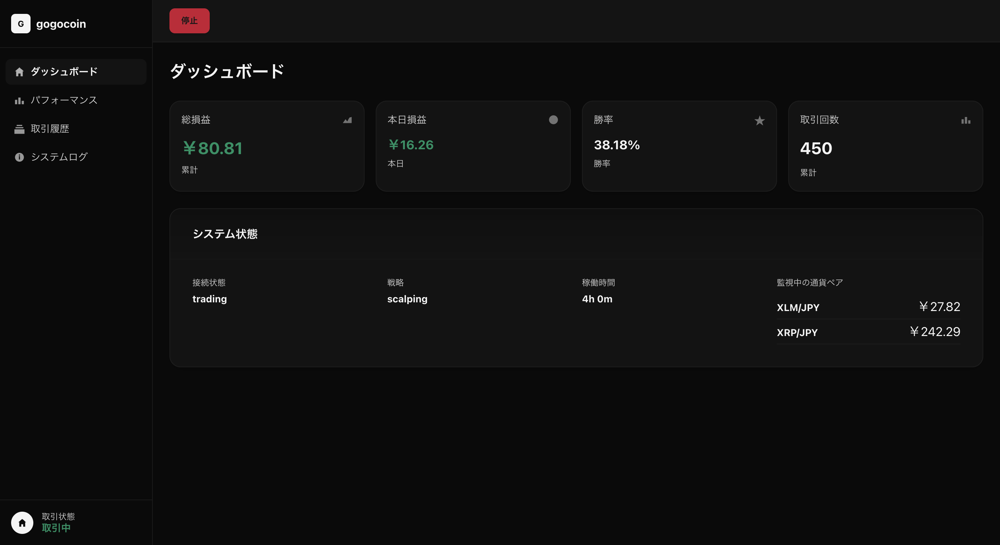

# gogocoin

[](https://github.com/bmf-san/gogocoin/actions/workflows/ci.yml)
[](https://github.com/bmf-san/gogocoin/actions/workflows/release.yml)
[](https://goreportcard.com/report/github.com/bmf-san/gogocoin)
[](https://github.com/bmf-san/gogocoin/blob/main/LICENSE)
[](https://github.com/bmf-san/gogocoin/releases)

bitFlyer取引所向けの暗号通貨取引ボット


This logo was created by [gopherize.me](https://gopherize.me/gopher/c3ef0a34f257bb18ea3b9b5a3ada0b1a0573e431).

## 概要

gogocoinは、bitFlyer暗号通貨取引所向けのGo言語製自動取引ボットです。EMAベースのスキャルピング戦略を使用し、設定可能な取引頻度で自動取引を実行します。

### 機能一覧

- スキャルピング戦略による自動取引（bitFlyer API統合）
- リスク管理（利確・ストップロス・1日の取引回数制限・クールダウン）
- WebUIによる取引の開始・停止制御
- WebSocketによるリアルタイム市場データ取得・分析
- WebダッシュボードによるリアルタイムモニタリングUI（`http://localhost:8080`）
- SQLiteによるデータ永続化
- 取引データの自動クリーンアップ（当日データのみ保持）
- 構造化ログ（レベル別・カテゴリ別フィルタリング対応）
- 24/7稼働対応（冪等性・再起動耐性）

### スクリーンショット



### 技術スタック

- **言語**: Go 1.23以上（開発環境: Go 1.25.0）
- **依存関係**: 最小限（go-bitflyer-api-client + yaml.v3 + sqlite3のみ）
- **アーキテクチャ**: レイヤー分離されたモジュラーアーキテクチャ
- **データベース**: SQLite（軽量・埋め込み・外部DB不要）
  - DB保持: 当日データのみ（1日）
  - 過去データ: bitFlyerで確認可能
- **並行処理**: Goroutines + Channels による非同期ワーカー
- **通信**: WebSocket（リアルタイム） + REST API（Web UI）
- **ログ**: 標準log/slogベースの構造化ログ
  - 高頻度ログフィルタリング（DEBUGレベル・dataカテゴリの2種類）
  - DBインデックス最適化（timestamp DESC）
- **パフォーマンス最適化**:
  - バランスキャッシュ（60秒TTL、APIコール90%削減）
  - 429エラー98%削減
  - デッドロック防止設計
- **デプロイ**: 埋め込みWebアセット付きシングルバイナリ
- **品質保証**:
  - 静的解析ツール対応（golangci-lint）
  - 複数パッケージにわたるユニットテスト
  - モジュラーアーキテクチャ（レイヤー分離設計）
  - 型安全性（Go言語の型システム活用）
  - エラーハンドリング（適切な例外処理）

## 免責事項

**重要: 必ずお読みください**

**このソフトウェアは情報提供および開発目的でのみ提供されており、金融アドバイスや投資判断を構成することを意図していません。暗号通貨取引は高リスクであり、投資元本を失う可能性があります。**

**実際の取引成績は市場環境、設定、タイミング等により大きく変動します。過去のバックテスト結果やシミュレーション結果は将来の成績を保証するものではありません。**

**このソフトウェアの使用により生じるいかなる損失や損害についても、作者は一切の責任を負いません。ご自身の判断と責任において使用してください。**

**このライブラリはbitFlyerと一切関係ありません。使用前に各APIプロバイダーの利用規約を確認してください。**

**このライブラリは「現状のまま」提供され、正確性、完全性、将来の互換性についていかなる保証もありません。**

## クイックスタート

### 前提条件

- Docker と Docker Compose
- bitFlyer APIキー（[管理画面](https://bitflyer.com/ja-jp/api)で取得）

> ローカル開発（Docker なし）の場合は Go 1.25.0 以上が必要です。

### セットアップ

```bash
# 1. リポジトリのクローン
git clone https://github.com/bmf-san/gogocoin.git
cd gogocoin

# 2. 環境変数の設定
cp .env.example .env
# .envファイルを編集してAPIキーを設定

# 3. 設定ファイルの作成
make init

# 4. 起動
make up

# 5. Web UIにアクセス
open http://localhost:8080

```

### .envファイルの設定例

```bash
BITFLYER_API_KEY=your_actual_api_key_here
BITFLYER_API_SECRET=your_actual_api_secret_here

```

**⚠️ 注意**: このボットはライブトレードのみ対応しています。実資金を使用するため、設定を十分に確認してから使用してください。

### コンテナ管理

```bash
# ログを確認
make logs
# または: docker compose logs -f

# 停止
make down
# または: docker compose down

# 再起動
make restart
# または: docker compose restart

# イメージ再ビルド
make rebuild
# または: docker compose up -d --build

```

## 使い方

### コンテナ管理

```bash
# 起動
make up

# ログ確認
make logs

# 停止
make down

# 再起動
make restart

# 再ビルド
make rebuild

```

### Web UI

ブラウザで取引状況をリアルタイム監視できます: `http://localhost:8080`

取引の開始・停止もWeb UIから操作できます。詳細は[機能一覧](#機能一覧)を参照してください。

## ドキュメント

| ドキュメント | 内容 |
|---|---|
| [docs/CONFIG.md](docs/CONFIG.md) | 設定リファレンス |
| [docs/STRATEGY.md](docs/STRATEGY.md) | 取引戦略リファレンス |
| [docs/DATA_MANAGEMENT.md](docs/DATA_MANAGEMENT.md) | データ管理リファレンス |
| [docs/DESIGN_DOC.md](docs/DESIGN_DOC.md) | アーキテクチャ設計ドキュメント |
| [docs/openapi.yaml](docs/openapi.yaml) | API仕様（OpenAPI 3.1） |

## 運用

### 推奨運用

1. Docker volume で `./data/` を永続化（設定済み）
2. 週1回程度の再起動で安定性向上
3. ログレベルは `info` を推奨（`debug` は開発時のみ）

### トラブルシューティング

- ログ確認: `make logs` または `docker compose logs -f`
- DB状態確認: `ls -lh ./data/gogocoin.db`
- コンテナ再起動: `make restart`

## 開発

### ローカル開発

```bash
# 依存関係インストール
make deps

# 開発ツールインストール（golangci-lint・oapi-codegen 等）
make install-tools

# テスト実行
make test

# カバレッジ確認
make test-coverage

# コードフォーマット
make fmt

# リンター実行
make lint

# Docker経由で実行
make up

```

### API コード生成

`docs/openapi.yaml` を変更した場合は、`oapi-codegen` でコードを再生成してコミットしてください。

```bash
# api.gen.go を再生成
make generate

```

> `internal/api/api.gen.go` は自動生成ファイルです。直接編集せず、必ず `make generate` 経由で更新してください。
> CI の `codegen` ジョブが spec と生成コードの同期を検証します。

## 関連

- [gogocoin-vps-template](https://github.com/bmf-san/gogocoin-vps-template) — VPS（ConoHa 等）に systemd + GitHub Actions でデプロイする運用構成のテンプレート

## コントリビューション

[CONTRIBUTING.md](.github/CONTRIBUTING.md) を参照してください。
