# gogocoin Architecture Design Doc

## 1. Architecture Overview

### 1.1 C4 Context — System Overview

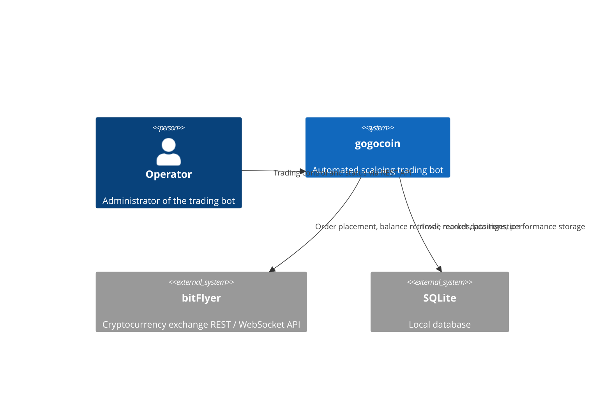
```mermaid
C4Context
    Person(operator, "Operator", "Administrator of the trading bot")
    System(gogocoin, "gogocoin", "Automated scalping trading bot")
    System_Ext(bitflyer, "bitFlyer", "Cryptocurrency exchange REST / WebSocket API")
    System_Ext(sqlite, "SQLite", "Local database")

    Rel(operator, gogocoin, "Trading control and status via REST API")
    Rel(gogocoin, bitflyer, "Order placement, balance retrieval, market data ingestion")
    Rel(gogocoin, sqlite, "Trade records, positions, performance storage")
```

### 1.2 C4 Container — Key Containers

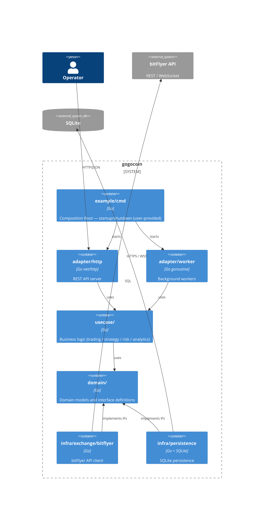
```mermaid
C4Container
    Person(operator, "Operator")

    System_Boundary(gogocoin, "gogocoin") {
        Container(example, "example/cmd", "Go", "Composition Root — startup/shutdown (user-provided)")
        Container(http, "adapter/http", "Go net/http", "REST API server")
        Container(worker, "adapter/worker", "Go goroutine", "Background workers")
        Container(usecase, "usecase/", "Go", "Business logic (trading / strategy / risk / analytics)")
        Container(domain, "domain/", "Go", "Domain models and interface definitions")
        Container(infra_bf, "infra/exchange/bitflyer", "Go", "bitFlyer API client")
        Container(infra_db, "infra/persistence", "Go + SQLite", "SQLite persistence")
    }

    System_Ext(bitflyer_api, "bitFlyer API", "REST / WebSocket")
    SystemDb_Ext(sqlite, "SQLite")

    Rel(operator, http, "HTTP/JSON")
    Rel(example, http, "starts")
    Rel(example, worker, "starts")
    Rel(http, usecase, "uses")
    Rel(worker, usecase, "uses")
    Rel(usecase, domain, "uses")
    Rel(infra_bf, domain, "implements IFs")
    Rel(infra_db, domain, "implements IFs")
    Rel(infra_bf, bitflyer_api, "HTTPS / WSS")
    Rel(infra_db, sqlite, "SQL")
```

### 1.3 C4 Component — usecase/trading

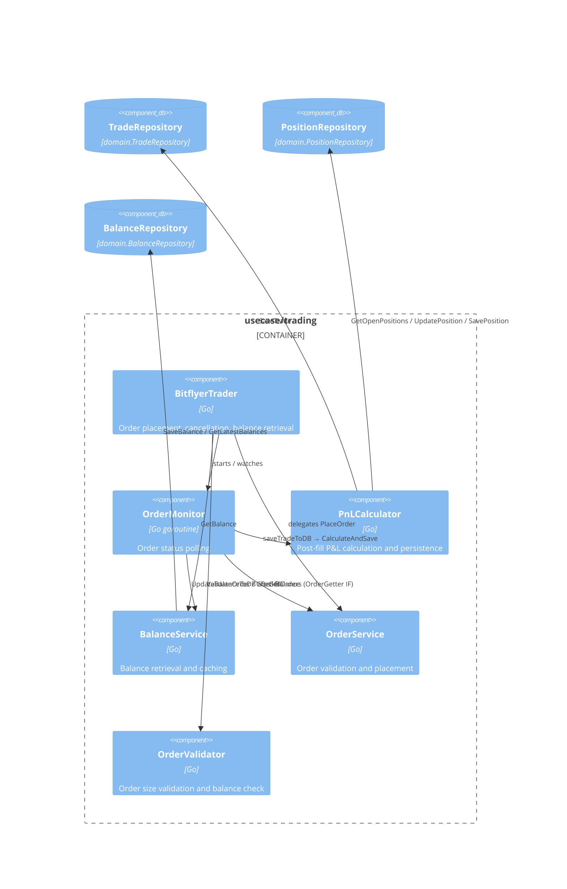
```mermaid
C4Component
    Container_Boundary(trading, "usecase/trading") {
        Component(trader, "BitflyerTrader", "Go", "Order placement, cancellation, balance retrieval")
        Component(monitor, "OrderMonitor", "Go goroutine", "Order status polling")
        Component(pnl, "PnLCalculator", "Go", "Post-fill P&L calculation and persistence")
        Component(balance, "BalanceService", "Go", "Balance retrieval and caching")
        Component(order, "OrderService", "Go", "Order validation and placement")
        Component(validator, "OrderValidator", "Go", "Order size validation and balance check")
    }

    ComponentDb(tradeRepo, "TradeRepository", "domain.TradeRepository")
    ComponentDb(positionRepo, "PositionRepository", "domain.PositionRepository")
    ComponentDb(balanceRepo, "BalanceRepository", "domain.BalanceRepository")

    Rel(trader, monitor, "starts / watches")
    Rel(trader, order, "delegates PlaceOrder")
    Rel(trader, validator, "ValidateOrder / CheckBalance")
    Rel(monitor, order, "GetOrders (OrderGetter IF)")
    Rel(monitor, pnl, "saveTradeToDB → CalculateAndSave")
    Rel(monitor, balance, "UpdateBalanceToDB after fill")
    Rel(pnl, tradeRepo, "SaveTrade")
    Rel(pnl, positionRepo, "GetOpenPositions / UpdatePosition / SavePosition")
    Rel(trader, balance, "GetBalance")
    Rel(balance, balanceRepo, "SaveBalance / GetLatestBalances")
```

### Dependency Rules

| Rule | Description |
|---|---|
| `domain/` has zero internal imports | stdlib only. Knows nothing about infra or usecase |
| `usecase/` does not import `infra/` | Depends only on `domain/` interfaces |
| `adapter/` holds no concrete `infra/` types | Uses only `domain/` interfaces |
| `infra/` implements `domain/` | Knows nothing about `usecase/` or `adapter/` |
| The caller's `main` combines all packages | The sole exception as the Composition Root (lives in user repo, e.g. `example/cmd`) |

---

## 2. Directory Structure

```
gogocoin/
├── example/                  # Working sample — also the Docker entry point
│   ├── cmd/main.go           # Signal handling and engine.Run() call
│   ├── strategy/scalping/    # Bundled EMA+RSI strategy
│   ├── configs/              # Config template
│   ├── Dockerfile            # Build context: repo root
│   └── docker-compose.yml
├── internal/
│   ├── domain/               # Layer 0: Models and interface definitions
│   │   ├── trade.go
│   │   ├── position.go
│   │   ├── order.go
│   │   ├── balance.go
│   │   ├── market_data.go
│   │   ├── performance.go
│   │   ├── log.go
│   │   ├── repository.go     # Persistence interface group
│   │   ├── service.go        # Common service interfaces (MarketSpecService, etc.)
│   │   └── errors.go         # Sentinel error definitions
│   │
│   ├── usecase/              # Layer 1: Business logic (infra-independent)
│   │   ├── trading/
│   │   │   ├── interfaces.go
│   │   │   ├── trader.go
│   │   │   ├── balance/
│   │   │   ├── pnl/
│   │   │   ├── monitor/
│   │   │   ├── order/
│   │   │   └── validator/
│   │   ├── risk/
│   │   └── analytics/
│   │
│   ├── adapter/              # Layer 2: Input/output adapters
│   │   ├── http/             # REST API server
│   │   │   ├── server.go             # HTTP server and route registration
│   │   │   ├── handler_control.go    # Trading control handlers (start/stop)
│   │   │   ├── handler_data.go       # Data retrieval handlers (market/trades/positions, etc.)
│   │   │   ├── handler_status.go     # Status check handlers
│   │   │   ├── contracts.go          # Consumer-driven IFs such as TradingStateController
│   │   │   ├── api.gen.go            # Generated by oapi-codegen (do not edit directly)
│   │   │   └── oapi-codegen.yaml     # Code generation config
│   │   └── worker/           # Background workers
│   │       ├── contracts.go          # Worker / HealthChecker / Stoppable IFs
│   │       ├── manager.go            # WorkerManager (start, stop, health of all workers)
│   │       ├── market_data.go        # MarketDataWorker
│   │       ├── strategy_worker.go    # StrategyWorker
│   │       ├── signal_worker.go      # SignalWorker
│   │       ├── maintenance.go        # MaintenanceWorker
│   │       └── strategy_monitor.go   # StrategyMonitorWorker
│   │
│   ├── infra/                # Layer 3: Infrastructure implementations
│   │   ├── exchange/
│   │   │   └── bitflyer/     # bitFlyer API client
│   │   └── persistence/      # SQLite persistence
│   │       ├── db.go                 # DB connection only
│   │       ├── migrate.go            # Migration application
│   │       ├── repository.go         # RepositoryFacade (aggregates all repositories)
│   │       ├── transaction.go        # TransactionManager implementation
│   │       ├── trade_repo.go
│   │       ├── position_repo.go
│   │       ├── balance_repo.go
│   │       ├── market_data_repo.go
│   │       ├── performance_repo.go
│   │       ├── log_repo.go
│   │       ├── app_state_repo.go
│   │       ├── maintenance_repo.go
│   │       └── schema/               # Migration SQL files
│   │
│   ├── config/               # Cross-cutting concern (config loading and validation)
│   └── logger/               # Cross-cutting concern (structured logging and DB integration)
│
├── pkg/                      # Public API (subject to semantic versioning)
│   ├── engine/
│   │   ├── engine.go         # Run() / RunWithLogger()
│   │   └── options.go        # WithStrategy() / WithConfigPath()
│   └── strategy/
│       ├── strategy.go       # Strategy interface
│       ├── signal.go         # Signal type (BUY / SELL / HOLD)
│       ├── market_data.go    # MarketData type
│       ├── metrics.go        # StrategyMetrics / StrategyStatus types
│       ├── base.go           # BaseStrategy (common fields and default implementations)
│       ├── registry.go       # Registry (ctor registration and lookup)
│       └── scalping/         # Bundled default strategy
```

---

## 3. Interface Design

### Where to Define Interfaces

| Kind | Definition location | Example |
|---|---|---|
| Data persistence IFs | `domain/repository.go` | `TradeRepository`, `PositionRepository` |
| Common service IFs used across packages | `domain/service.go` | `MarketSpecService` |
| Behavioral IFs between specific services | Consumer-driven (defined in the consuming package) | `worker.RiskChecker`, `http.TradingStateController` |

### `domain/service.go`

```go
package domain

// MarketSpecService provides exchange-specific market specifications.
type MarketSpecService interface {
    GetMinimumOrderSize(symbol string) (float64, error)
}
```

### Error definitions in `domain/errors.go`

The current `domain/errors.go` uses a struct-based `*Error` with `ErrType` classification and `Unwrap()`.

```go
// ErrType classifies error categories
const (
    ErrTypeRateLimit ErrType = "rate_limit"
    ErrTypeNetwork   ErrType = "network"
    // ...
)

// sentinels are of type *domain.Error
var ErrRateLimitExceeded = NewError(ErrTypeRateLimit, "rate limit exceeded", nil)

// Callers use errors.As() to type-assert and check ErrType
if apiErr := new(domain.Error); errors.As(err, &apiErr) {
    if apiErr.Type == domain.ErrTypeRateLimit { /* handle */ }
}
```

`infra/exchange/bitflyer/` returns `domain.ErrRateLimitExceeded` directly or wrapped.
`usecase/` and `adapter/` use `errors.As()` to convert to `*domain.Error` and check `ErrType`, allowing error classification without knowing the bitflyer package.

---

## 4. Component Design

### 4.1 Composition Root

The Composition Root lives in the **caller's repository** (e.g. `example/cmd/main.go`, `my-gogocoin/cmd/main.go`). gogocoin itself is a library; it does not ship a `cmd/` directory.

A typical entry point:

```go
// example/cmd/main.go
package main

import (
    "github.com/bmf-san/gogocoin/pkg/engine"
    _ "github.com/yourname/your-bot/strategy/scalping" // triggers init()
)

func main() {
    engine.Run(ctx, engine.WithConfigPath("./configs/config.yaml"))
}
```

`engine.Run()` internally wires all services. A sketch of what happens inside:

```go
// bootstrap.go sketch
db, _        := persistence.NewDB(cfg.Database.Path)
tradeRepo    := persistence.NewTradeRepository(db)
positionRepo := persistence.NewPositionRepository(db)
// db also implements TransactionManager (BeginTx)
pnlCalc := pnl.NewCalculator(tradeRepo, positionRepo, db, log, strategyName)
trader  := trading.NewBitflyerTrader(bfClient, pnlCalc, log)
// ...
```

The bitFlyer WebSocket reconnection loop is also managed in `bootstrap.go`.
The `usecase/` layer knows nothing about connection management.

```go
// bootstrap.go sketch (reconnection loop)
go func() {
    for {
        if err := ws.Connect(ctx); err != nil {
            if ctx.Err() != nil { return }
        }
        // Same interval for both normal and error disconnects
        if ctx.Err() != nil { return }
        time.Sleep(reconnectInterval)
    }
}()
```

### 4.2 TradingController (`cmd/gogocoin/trading_ctrl.go`)

Manages the enabled/disabled state of trading. Interfaces are defined consumer-driven in each adapter package, and `cmd/gogocoin/trading_ctrl.go` provides the implementation. This preserves the dependency direction so that the adapter layer does not directly reference the cmd layer.

```go
// adapter/http/contracts.go (consumer-driven)
type TradingStateController interface {
    IsTradingEnabled() bool
    SetTradingEnabled(ctx context.Context, enabled bool) error
}

// adapter/worker/contracts.go (consumer-driven)
type TradingStateReader interface {
    IsTradingEnabled() bool
}

// cmd/gogocoin/trading_ctrl.go (sole implementation)
type TradingController struct {
    mu      sync.RWMutex
    enabled bool
    db      domain.AppStateRepository
    logger  logger.LoggerInterface
}

func (tc *TradingController) IsTradingEnabled() bool
func (tc *TradingController) SetTradingEnabled(ctx context.Context, enabled bool) error
```

`cmd/bootstrap.go` reads `trading_enabled` from the DB on startup and initializes the `enabled` field.
The previous trading state is preserved across restarts.

`cmd/bootstrap.go` creates a `*TradingController` and injects it into `adapter/http.Server` and
`adapter/worker.SignalWorker` as their respective interface types.

### 4.3 persistence (`infra/persistence/`)

#### Aggregate design rationale

Repository interfaces in `domain/` are defined based on **aggregate boundaries**.

| Aggregate root | Lifecycle | Repository IF |
|---|---|---|
| `Trade` | Created on fill. Immutable. | `TradeRepository` |
| `Position` | Created on BUY, updated by multiple SELLs (FIFO), terminated on CLOSED. Lifecycle independent of `Trade`. | `PositionRepository` |
| `Balance` | Balance snapshot. Append-only on order completion (INSERT only). Reads return only the latest snapshot. | `BalanceRepository` (SaveBalance / GetLatestBalances) |
| `MarketData` | Time-series data. Written continuously by workers. Also readable via REST API. | `MarketDataRepository` |
| `PerformanceMetric` | Statistical snapshot calculated and appended after each trade. Also provides latest value retrieval. | `PerformanceRepository` (SavePerformanceMetric / GetLatestPerformanceMetric) |
| `PerformanceMetric` (analytics) | Read-only for daily aggregations. Writes delegated to `PerformanceRepository`. | `AnalyticsRepository` (GetPerformanceMetrics(days int) only) · **consumer-driven, defined in usecase/analytics** |
| `LogEntry` | Persistent application event log. Also exposed via REST API `GET /api/logs`. | `LogRepository` (SaveLog / GetRecentLogsWithFilters) |
| `AppState` | KV store. Infrastructure concern. | `AppStateRepository` |

PnL Calculator is a use case that **atomically updates both Trade and Position across aggregates**.
Rather than a `domain.TradingRepository` composite IF, it accepts **individual repositories + `TransactionManager`** separately.
The `domain.TradingRepository` composite IF is deprecated.

```go
// usecase/trading/pnl/calculator.go
func NewCalculator(
    tradeRepo    domain.TradeRepository,
    positionRepo domain.PositionRepository,
    txMgr        domain.TransactionManager,  // Atomically saves Trade+Position via BeginTx()
    log          logger.LoggerInterface,
    strategyName string,
) *Calculator
```

> **Note**: `BalanceRepository` is outside PnL Calculator's responsibility. Balance updates are performed by `OrderMonitor` via `BalanceUpdater.UpdateBalanceToDB()` (after PnL save completes).

Independent implementations are created in `cmd/bootstrap.go` and injected. No composite IF wrapper is needed.

#### Implementation structure

DB connection (`db.go`) and repository implementations are separated.
Each repository struct accepts `*DB` and implements the interfaces in `domain/repository.go`.

```go
// db.go: connection management + TransactionManager + DatabaseLifecycle implementation
type DB struct{ conn *sql.DB }
func (db *DB) Close() error                          // domain.DatabaseLifecycle
func (db *DB) Ping() error                           // domain.DatabaseLifecycle
func (db *DB) BeginTx() (domain.Transaction, error)  // domain.TransactionManager

// trade_repo.go
type TradeRepository struct{ db *DB }
func NewTradeRepository(db *DB) *TradeRepository
func (r *TradeRepository) SaveTrade(trade *domain.Trade) error
func (r *TradeRepository) GetRecentTrades(limit int) ([]domain.Trade, error)
```

Similarly, `PositionRepository`, `BalanceRepository`, `MarketDataRepository`,
`PerformanceRepository`, `LogRepository`, `AppStateRepository`, `MaintenanceRepository`
are each defined as independent structs.

`TransactionManager` is implemented directly by `*persistence.DB` (returning `domain.Transaction`).

### 4.4 usecase/risk

`risk.Manager` does not depend on the `config` package. It uses its own parameter type extracted from `config.RiskManagementConfig` and `config.TradingConfig` (same pattern as § 4.5 strategy).

Balance retrieval uses a consumer-driven local interface, avoiding any dependency on `usecase/trading`.
`TradingRepository` / `AnalyticsRepository` are also defined as consumer-driven local IFs.

```go
// usecase/risk/manager.go

// ManagerConfig holds risk management parameters. Does not depend on the config package.
// Converted from config.RiskManagementConfig / config.TradingConfig in cmd/bootstrap.go and injected.
type ManagerConfig struct {
    MaxTotalLossPercent   float64
    MaxTradeLossPercent   float64
    MaxDailyLossPercent   float64
    MaxTradeAmountPercent float64
    MaxDailyTrades        int
    MinTradeInterval      time.Duration
    FeeRate               float64
    InitialBalance        float64
}

// TradingRepository is the minimal IF for recent trade retrieval
type TradingRepository interface {
    GetRecentTrades(limit int) ([]domain.Trade, error)
}

// AnalyticsRepository is the minimal IF for performance metric retrieval
type AnalyticsRepository interface {
    GetPerformanceMetrics(days int) ([]domain.PerformanceMetric, error)
}

type Manager struct {
    cfg           ManagerConfig
    tradingRepo   TradingRepository
    analyticsRepo AnalyticsRepository
    trader        trading.Trader
    logger        logger.LoggerInterface
}
```

---

## 5. Pluggable Strategy Architecture (`pkg/`)

gogocoin exposes a **`pkg/`** public API so that repository users can inject their own trading strategies.
`internal/` cannot be imported from outside, but `pkg/` is treated as a stable, semantically versioned API.

```
pkg/
├── engine/
│   ├── engine.go   # Run() / RunWithLogger()
│   └── options.go  # WithStrategy() / WithConfigPath()
└── strategy/
    ├── strategy.go     # Strategy interface
    ├── signal.go       # Signal type (BUY / SELL / HOLD)
    ├── market_data.go  # MarketData type
    ├── metrics.go      # StrategyMetrics / StrategyStatus types
    ├── base.go         # BaseStrategy (common fields and default implementations)
    ├── registry.go     # Registry (ctor registration and lookup)
    └── scalping/       # Bundled default strategy
```

### 5.1 `pkg/strategy.Strategy` Interface

```go
type Strategy interface {
    // Signal generation
    GenerateSignal(ctx context.Context, data *MarketData, history []MarketData) (*Signal, error)
    Analyze(data []MarketData) (*Signal, error)

    // Lifecycle
    Start(ctx context.Context) error
    Stop(ctx context.Context) error
    IsRunning() bool
    GetStatus() StrategyStatus
    Reset() error

    // Metrics and trade counts
    GetMetrics() StrategyMetrics
    RecordTrade()
    InitializeDailyTradeCount(count int)

    // Configuration
    Name() string
    Description() string
    Version() string
    Initialize(config map[string]interface{}) error   // Receives the strategy_params.<name> block from config.yaml
    UpdateConfig(config map[string]interface{}) error
    GetConfig() map[string]interface{}
}
```

### 5.2 How to Implement a Custom Strategy

**1. Create a separate repository and add gogocoin to `go.mod`**

```bash
go get github.com/bmf-san/gogocoin@latest
```

**2. Embed `pkg/strategy.BaseStrategy` and implement the strategy**

`BaseStrategy` provides default implementations for lifecycle (Start/Stop/IsRunning/GetStatus/Reset),
trade counting (RecordTrade/InitializeDailyTradeCount), and metrics.

```go
package mystrategy

import (
    "context"

    "github.com/bmf-san/gogocoin/pkg/strategy"
)

type MyStrategy struct {
    strategy.BaseStrategy
    // strategy-specific fields
}

func New() strategy.Strategy { return &MyStrategy{} }

func (s *MyStrategy) Name() string        { return "mystrategy" }
func (s *MyStrategy) Description() string { return "My custom strategy" }
func (s *MyStrategy) Version() string     { return "0.1.0" }

func (s *MyStrategy) Initialize(cfg map[string]interface{}) error {
    // Receives the strategy_params.mystrategy block from config.yaml
    return nil
}

func (s *MyStrategy) UpdateConfig(cfg map[string]interface{}) error { return s.Initialize(cfg) }
func (s *MyStrategy) GetConfig() map[string]interface{}             { return nil }

func (s *MyStrategy) GenerateSignal(
    ctx context.Context,
    data *strategy.MarketData,
    history []strategy.MarketData,
) (*strategy.Signal, error) {
    // Signal logic
    return &strategy.Signal{Action: strategy.Hold}, nil
}

func (s *MyStrategy) Analyze(data []strategy.MarketData) (*strategy.Signal, error) {
    return &strategy.Signal{Action: strategy.Hold}, nil
}
```

**3. Implement the entry point with `engine.Run()`**

```go
package main

import (
    "context"
    "os"
    "os/signal"
    "syscall"

    "github.com/bmf-san/gogocoin/pkg/engine"
    pkgstrategy "github.com/bmf-san/gogocoin/pkg/strategy"
    "example.com/myrepo/mystrategy"
)

func main() {
    ctx, stop := signal.NotifyContext(context.Background(), os.Interrupt, syscall.SIGTERM)
    defer stop()

    if err := engine.Run(ctx,
        engine.WithStrategy("mystrategy", func() pkgstrategy.Strategy { return mystrategy.New() }),
        engine.WithConfigPath("./configs/config.yaml"),
    ); err != nil {
        os.Exit(1)
    }
}
```

**4. Specify the strategy name in `config.yaml`**

```yaml
trading:
  strategy:
    name: "mystrategy"   # Must match the first argument of WithStrategy()

strategy_params:
  mystrategy:            # Key of the map passed to Initialize()
    my_param: 42
```

### 5.3 Internal flow of `pkg/engine.Run()`

```
engine.Run(ctx, opts...)
  └─ config.Load()                    # Load configPath
  └─ logger.New()                     # Initialize structured logger
  └─ run(ctx, cfg, log, ec)
       ├─ persistence.NewDB()         # SQLite connection and migration
       ├─ bitflyer.NewClient()        # bitFlyer API client
       ├─ registry.Get(cfg.trading.strategy.name)
       │    └─ Constructor()          # Calls the ctor registered via WithStrategy()
       ├─ strategy.Initialize(strategyParams)
       ├─ WorkerManager.Start()       # Starts MarketDataWorker / StrategyWorker / etc.
       ├─ HTTPServer.Start()          # REST API + Web UI
       └─ <ctx.Done()> → graceful shutdown
```

### 5.4 Bundled strategy: `pkg/strategy/scalping`

EMA crossover + RSI filter scalping strategy.
Register via `engine.WithStrategy("scalping", scalping.NewDefault)`.
For detailed parameters see [pkg/strategy/scalping/README.md](../pkg/strategy/scalping/README.md).

### 4.6 WorkerManager (`adapter/worker/`)

`WorkerManager` manages the lifecycle of all background workers.
`cmd/bootstrap.go` creates workers, registers them with `WorkerManager`, and starts/stops them together.

```go
// adapter/worker/contracts.go
type Worker interface {
    Run(ctx context.Context) error  // blocking until ctx is cancelled
    Name() string
}

// HealthStatus represents the operational state of a worker.
type HealthStatus struct {
    Running   bool
    LastError error
    LastCheck time.Time
}

// adapter/worker/manager.go
type WorkerManager struct {
    workers      map[string]Worker
    workerOrder  []string  // Preserves registration order. StartAll launches goroutines in this order.
    logger       logger.LoggerInterface
    // ...
}

func NewWorkerManager(logger logger.LoggerInterface) *WorkerManager
func (m *WorkerManager) Register(name string, worker Worker) error  // Duplicate names or post-StartAll registration returns error.
func (m *WorkerManager) StartAll(ctx context.Context) error
func (m *WorkerManager) StopAll() error
func (m *WorkerManager) HealthCheck() map[string]HealthStatus
```

Registered workers:

| Worker | Role |
|---|---|
| `MarketDataWorker` | Receives tick data from WebSocket and saves to DB |
| `StrategyWorker` | Receives from marketDataCh, generates signals, enforces engine-level stop loss, sends to signalCh |
| `SignalWorker` | Receives from signalCh, runs risk checks, and places orders |
| `MaintenanceWorker` | Periodically deletes old data from the DB |
| `StrategyMonitorWorker` | Checks strategy health every 5 minutes |

### 4.7 logger

All Worker constructors accept `logger.LoggerInterface`.
Type assertions to `*logger.Logger` are not performed.

`logger.LoggerInterface` provides:
- **Category loggers**: `System()`, `Trading()`, `API()`, `Strategy()`, `UI()`, `Data()`, `Category(string)`
- **Field helpers**: `WithFields()`, `WithField()`, `WithError()`
- **Dedicated log methods**: `LogTrade()`, `LogAPICall()`, `LogStrategySignal()`, `LogError()`, `LogPerformance()`, `LogStartup()`, `LogShutdown()`
- **Basic method**: `Error(msg string)`
- **Lifecycle**: `Flush()`, `Close() error`, `SetLevel() error`, `GetLevel() string`
- **DB integration**: `SetDatabase(domain.LogRepository)`

The mock implementation for tests is centralized in `logger/testing.go`.
Tests in each package import it (following the `net/http/httptest` pattern from the stdlib).

```go
// logger/testing.go
package logger

import (
    "io"
    "log/slog"

    "github.com/bmf-san/gogocoin/v1/internal/domain"
)

// nopSlog is a no-op slog.Logger targeting io.Discard. Used as the return value of WithFields etc.
// Returning nil would panic when calling Info() etc. on the result, so a discard-handler Logger
// is returned to guarantee safe method chaining.
var nopSlog = slog.New(slog.NewTextHandler(io.Discard, nil))

// NopLogger is a test-only implementation that produces no output.
// Implements all methods of LoggerInterface.
type NopLogger struct{}

func (n *NopLogger) System() *ExtendedLogger                                                     { return &NopExtendedLogger{} }
func (n *NopLogger) Trading() *ExtendedLogger                                                    { return &NopExtendedLogger{} }
func (n *NopLogger) API() *ExtendedLogger                                                        { return &NopExtendedLogger{} }
func (n *NopLogger) Strategy() *ExtendedLogger                                                   { return &NopExtendedLogger{} }
func (n *NopLogger) UI() *ExtendedLogger                                                         { return &NopExtendedLogger{} }
func (n *NopLogger) Data() *ExtendedLogger                                                       { return &NopExtendedLogger{} }
func (n *NopLogger) Category(category string) *ExtendedLogger                                    { return &NopExtendedLogger{} }
func (n *NopLogger) WithFields(fields map[string]any) *slog.Logger                               { return nopSlog }
func (n *NopLogger) WithField(key string, value any) *slog.Logger                                { return nopSlog }
func (n *NopLogger) WithError(err error) *slog.Logger                                            { return nopSlog }
func (n *NopLogger) LogTrade(action, symbol string, price, qty float64, f map[string]any)        {}
func (n *NopLogger) LogAPICall(method, ep string, dur int64, code int, err error)                {}
func (n *NopLogger) LogStrategySignal(strategy, sym, action string, s float64, m map[string]any) {}
func (n *NopLogger) LogError(cat, op string, err error, f map[string]any)                        {}
func (n *NopLogger) LogPerformance(op string, dur int64, f map[string]any)                       {}
func (n *NopLogger) LogStartup(version string, config map[string]any)                            {}
func (n *NopLogger) LogShutdown(reason string)                                                   {}
func (n *NopLogger) Error(msg string)                                                            {}
func (n *NopLogger) SetDatabase(db domain.LogRepository)                                         {}
func (n *NopLogger) Flush()                                                                      {}
func (n *NopLogger) Close() error                                                                { return nil }
func (n *NopLogger) SetLevel(level string) error                                                 { return nil }
func (n *NopLogger) GetLevel() string                                                            { return "" }

var _ LoggerInterface = (*NopLogger)(nil) // compile-time check
```

> Category logger methods (`System()` etc.) return `&NopExtendedLogger{}`, not `nil`.
> `WithFields` / `WithField` / `WithError` return `nopSlog` (a `*slog.Logger` targeting `io.Discard`), not `nil`.
> This allows safe method chaining such as `n.System().Info(...)` or `n.WithField("k", "v").Info(...)`.
> `NopExtendedLogger` is a dedicated type implementing all methods of `*ExtendedLogger` as no-ops.
> The compile-time check `var _ LoggerInterface = (*NopLogger)(nil)` guarantees completeness.

### 4.8 usecase/analytics

Use case layer responsible for aggregating and analyzing performance metrics.

Read-only use case for external consumers, independent of the `PerformanceRepository` (write and latest-value retrieval flow).
Called from the `adapter/http` `/api/performance` endpoint.

```go
// usecase/analytics/analyzer.go

// AnalyticsRepository is a read-only consumer-driven IF.
// Separated from domain.PerformanceRepository to avoid write contention.
type AnalyticsRepository interface {
    GetPerformanceMetrics(days int) ([]domain.PerformanceMetric, error)
}

type Analyzer struct {
    repo   AnalyticsRepository
    logger logger.LoggerInterface
}

func NewAnalyzer(repo AnalyticsRepository, log logger.LoggerInterface) *Analyzer
func (a *Analyzer) GetMetrics(ctx context.Context, days int) ([]domain.PerformanceMetric, error)
```

In `cmd/bootstrap.go`, `infra/persistence.PerformanceRepository` (which implements both `PerformanceRepository` and `AnalyticsRepository`) is created and injected for each use.

---

## 5. Use Case Diagram


```mermaid
graph LR
    OP(["👤 Operator"])
    BF(["🏦 bitFlyer"])
    SYS(["⚙️ System"])

    subgraph sys["gogocoin system boundary"]
        UC1(Start trading)
        UC2(Stop trading)
        UC3(Check trading status)
        UC4(Check positions)
        UC5(Check performance)
        UC6(Check market data)
        UC7(Check balance)
        UC8(Check trade history)
        UC9(Check order list)
        UC10(Check logs)
        UC11(Check config)
        UC12(Reset strategy)
        UC13(Detect signal via scalping strategy)
        UC14(Run risk check)
        UC15(Place order)
        UC16(Monitor order status)
        UC17(Calculate and record P&L)
        UC18(Maintain old data)
        UC19(Monitor and update strategy params)
        UC20(Handle order timeout and cancellation)
    end

    OP --> UC1
    OP --> UC2
    OP --> UC3
    OP --> UC4
    OP --> UC5
    OP --> UC6
    OP --> UC7
    OP --> UC8
    OP --> UC9
    OP --> UC10
    OP --> UC11
    OP --> UC12
    UC13 --> UC14
    UC14 --> UC15
    UC15 --> UC16
    UC16 --> UC17
    BF -.->|"Fill notification (polling)"| UC16
    SYS --> UC13
    SYS --> UC18
    SYS --> UC19
    SYS --> UC20
```

---

## 6. Sequence Diagrams

### 6.1 Scalping Trade Flow

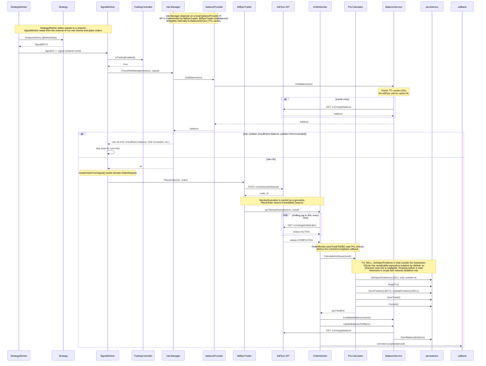
```mermaid
sequenceDiagram
    participant SW as StrategyWorker
    participant ST as Strategy
    participant SigW as SignalWorker
    participant TC as TradingController
    participant RM as risk.Manager
    participant BP as balanceProvider
    participant TR as BitflyerTrader
    participant BF as bitFlyer API
    participant OM as OrderMonitor
    participant PNL as PnLCalculator
    participant BS as BalanceService
    participant DB as persistence
    participant CB as callback

    note over RM,BP: risk.Manager depends on a local balanceProvider IF.<br/>BP is implemented by BitflyerTrader. BitflyerTrader.GetBalance()<br/>delegates internally to BalanceService (TTL cache).
    note over SW,SigW: StrategyWorker writes signals to a channel.<br/>SignalWorker reads from the channel to run risk checks and place orders.

    SW->>ST: Analyze(history []MarketData)
    ST-->>SW: Signal(BUY)
    SW-)SigW: signalCh <- signal (channel send)
    SigW->>TC: IsTradingEnabled()
    TC-->>SigW: true
    SigW->>RM: CheckRiskManagement(ctx, signal)
    RM->>BP: GetBalance(ctx)
    BP->>BS: GetBalance(ctx)
    note over BS: Check TTL cache (10s).<br/>No bitFlyer call on cache hit.
    alt cache miss
        BS->>BF: GET /v1/me/getbalance
        BF-->>BS: balance
    end
    BS-->>BP: balance
    BP-->>RM: balance
    alt risk violation (insufficient balance, position limit exceeded)
        RM-->>SigW: non-nil error (insufficient balance, limit exceeded, etc.)
        SigW->>SigW: skip (wait for next tick)
    else risk OK
        RM-->>SigW: nil
        note over SigW: createOrderFromSignal() builds domain.OrderRequest
        SigW->>TR: PlaceOrder(ctx, order)
        TR->>BF: POST /v1/me/sendchildorder
        BF-->>TR: order_id
        note over TR,OM: MonitorExecution is started as a goroutine.<br/>PlaceOrder returns immediately (async).
        TR-)OM: go MonitorExecution(ctx, result)

        loop Polling (up to 90s, every 15s)
            OM->>BF: GET /v1/me/getchildorders
            BF-->>OM: status=ACTIVE
        end

        BF-->>OM: status=COMPLETED
        note over OM,PNL: OrderMonitor.saveTradeToDB() calls PnL directly.<br/>Before the onOrderCompleted callback.
        OM->>PNL: CalculateAndSave(result)
        note over PNL,DB: For SELL, GetOpenPositions is read outside the transaction.<br/>SQLite has serializable-equivalent isolation by default, so<br/>phantom read risk is negligible. Reading before tx start<br/>minimizes tx scope and reduces deadlock risk.
        PNL->>DB: GetOpenPositions() [SELL only, outside tx]
        PNL->>DB: BeginTx()
        PNL->>DB: SavePosition() [BUY] / UpdatePosition() [SELL]
        PNL->>DB: SaveTrade()
        PNL->>DB: Commit()
        PNL-->>OM: (pnl float64)
        OM->>BS: InvalidateBalanceCache()
        OM->>BS: UpdateBalanceToDB(ctx)
        BS->>BF: GET /v1/me/getbalance
        BS->>DB: SaveBalance(balance)
        OM->>CB: onOrderCompleted(result)
    end
```

### 6.2 REST API Trading Control Flow

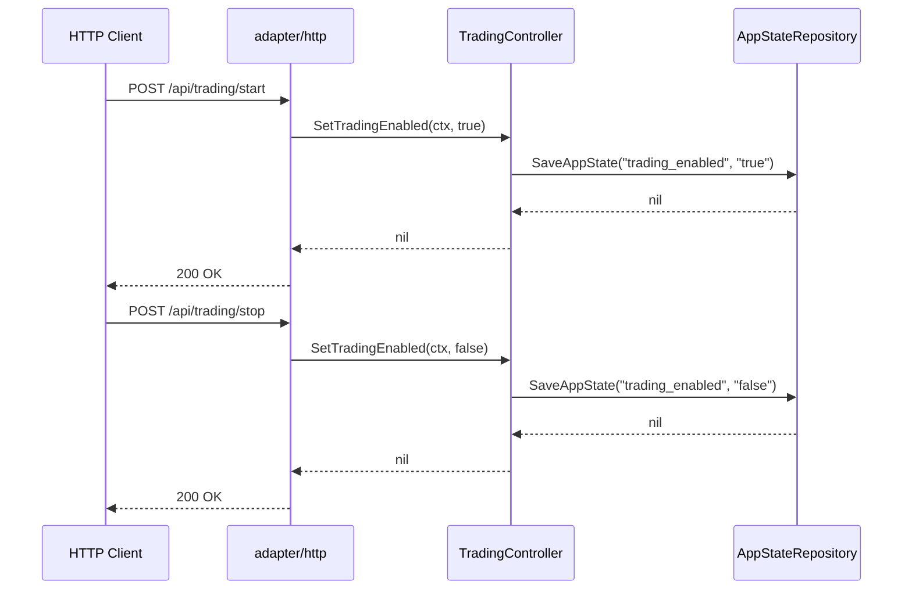
```mermaid
sequenceDiagram
    participant C as HTTP Client
    participant H as adapter/http
    participant TC as TradingController
    participant DB as AppStateRepository

    C->>H: POST /api/trading/start
    H->>TC: SetTradingEnabled(ctx, true)
    TC->>DB: SaveAppState("trading_enabled", "true")
    DB-->>TC: nil
    TC-->>H: nil
    H-->>C: 200 OK

    C->>H: POST /api/trading/stop
    H->>TC: SetTradingEnabled(ctx, false)
    TC->>DB: SaveAppState("trading_enabled", "false")
    DB-->>TC: nil
    TC-->>H: nil
    H-->>C: 200 OK
```

### 6.3 Market Data Collection Flow

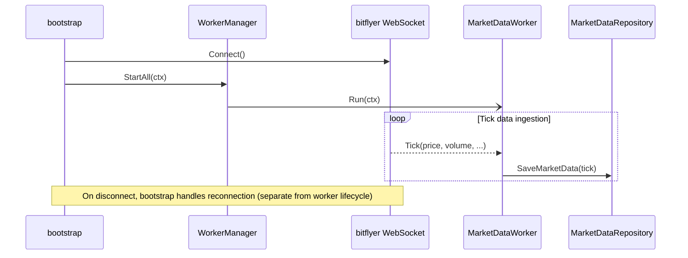
```mermaid
sequenceDiagram
    participant BS as bootstrap
    participant WM as WorkerManager
    participant WS as bitflyer WebSocket
    participant MW as MarketDataWorker
    participant DB as MarketDataRepository

    BS->>WS: Connect()
    BS->>WM: StartAll(ctx)
    WM-)MW: Run(ctx)

    loop Tick data ingestion
        WS-->>MW: Tick(price, volume, ...)
        MW->>DB: SaveMarketData(tick)
    end

    note over BS,WS: On disconnect, bootstrap handles reconnection (separate from worker lifecycle)
```

### 6.4 Order Timeout / CANCELED / EXPIRED Flow

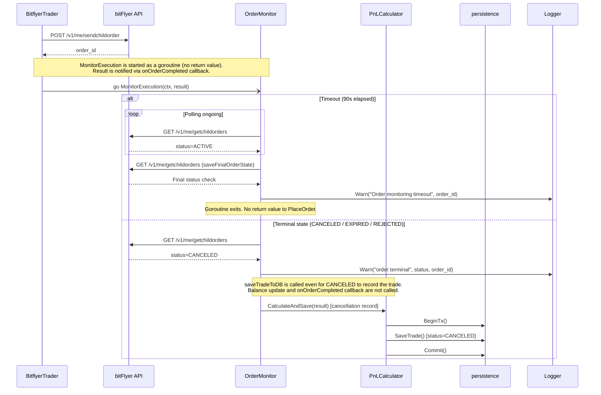
```mermaid
sequenceDiagram
    participant TR as BitflyerTrader
    participant BF as bitFlyer API
    participant OM as OrderMonitor
    participant PNL as PnLCalculator
    participant DB as persistence
    participant LOG as Logger

    TR->>BF: POST /v1/me/sendchildorder
    BF-->>TR: order_id
    note over TR,OM: MonitorExecution is started as a goroutine (no return value).<br/>Result is notified via onOrderCompleted callback.
    TR-)OM: go MonitorExecution(ctx, result)

    alt Timeout (90s elapsed)
        loop Polling ongoing
            OM->>BF: GET /v1/me/getchildorders
            BF-->>OM: status=ACTIVE
        end
        OM->>BF: GET /v1/me/getchildorders (saveFinalOrderState)
        BF-->>OM: Final status check
        OM->>LOG: Warn("Order monitoring timeout", order_id)
        note over OM: Goroutine exits. No return value to PlaceOrder.
    else Terminal state (CANCELED / EXPIRED / REJECTED)
        OM->>BF: GET /v1/me/getchildorders
        BF-->>OM: status=CANCELED
        OM->>LOG: Warn("order terminal", status, order_id)
        note over OM,PNL: saveTradeToDB is called even for CANCELED to record the trade.<br/>Balance update and onOrderCompleted callback are not called.
        OM->>PNL: CalculateAndSave(result) [cancellation record]
        PNL->>DB: BeginTx()
        PNL->>DB: SaveTrade() [status=CANCELED]
        PNL->>DB: Commit()
    end
```

### 6.5 Rate Limit Retry Flow

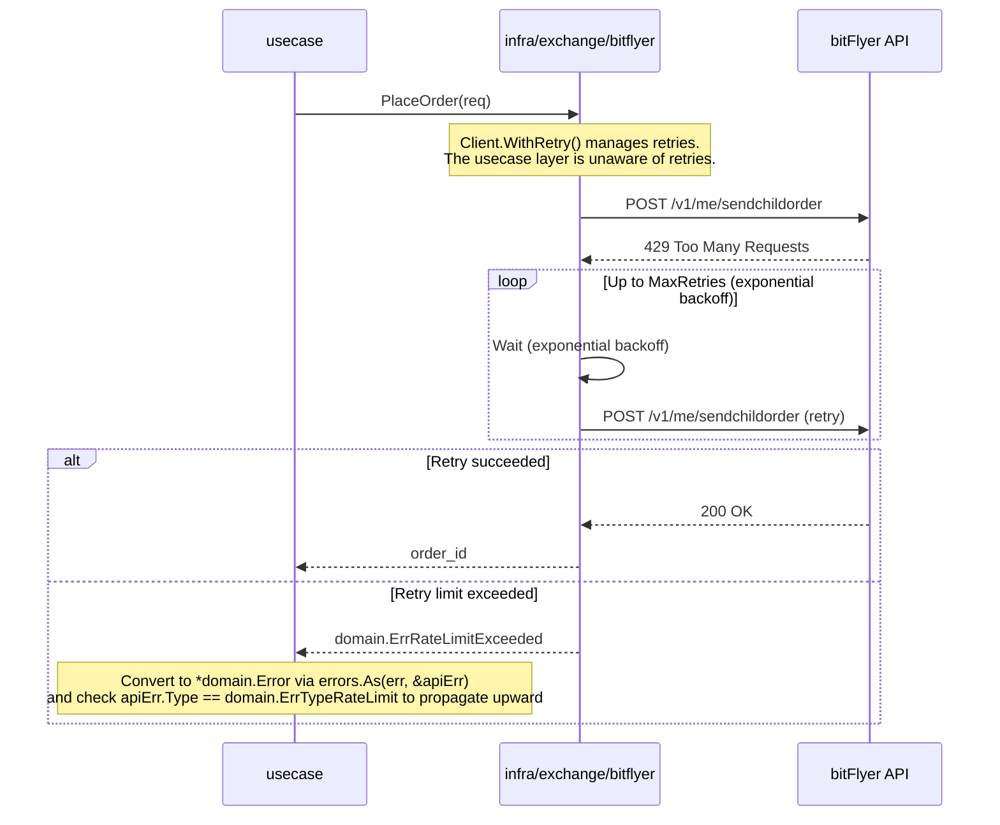
```mermaid
sequenceDiagram
    participant UC as usecase
    participant BF as infra/exchange/bitflyer
    participant API as bitFlyer API

    UC->>BF: PlaceOrder(req)
    note over BF: Client.WithRetry() manages retries.<br/>The usecase layer is unaware of retries.
    BF->>API: POST /v1/me/sendchildorder
    API-->>BF: 429 Too Many Requests
    loop Up to MaxRetries (exponential backoff)
        BF->>BF: Wait (exponential backoff)
        BF->>API: POST /v1/me/sendchildorder (retry)
    end
    alt Retry succeeded
        API-->>BF: 200 OK
        BF-->>UC: order_id
    else Retry limit exceeded
        BF-->>UC: domain.ErrRateLimitExceeded
        note over UC: Convert to *domain.Error via errors.As(err, &apiErr)<br/>and check apiErr.Type == domain.ErrTypeRateLimit to propagate upward
    end
```

### 6.6 MaintenanceWorker Flow

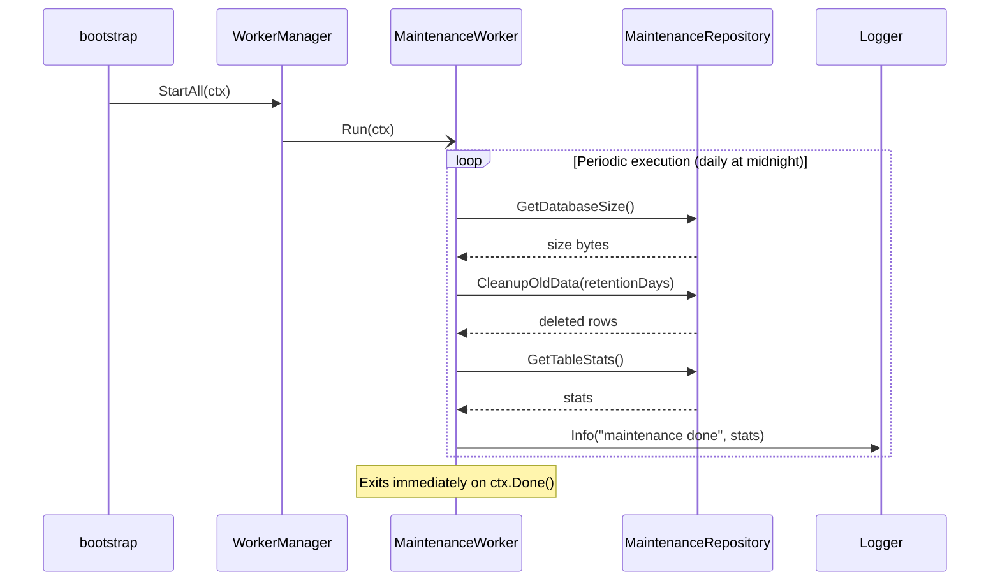
```mermaid
sequenceDiagram
    participant BS as bootstrap
    participant WM as WorkerManager
    participant MW as MaintenanceWorker
    participant DB as MaintenanceRepository
    participant LOG as Logger

    BS->>WM: StartAll(ctx)
    WM-)MW: Run(ctx)

    loop Periodic execution (daily at midnight)
        MW->>DB: GetDatabaseSize()
        DB-->>MW: size bytes
        MW->>DB: CleanupOldData(retentionDays)
        DB-->>MW: deleted rows
        MW->>DB: GetTableStats()
        DB-->>MW: stats
        MW->>LOG: Info("maintenance done", stats)
    end

    note over MW: Exits immediately on ctx.Done()
```

---

## 7. Dependency Graph

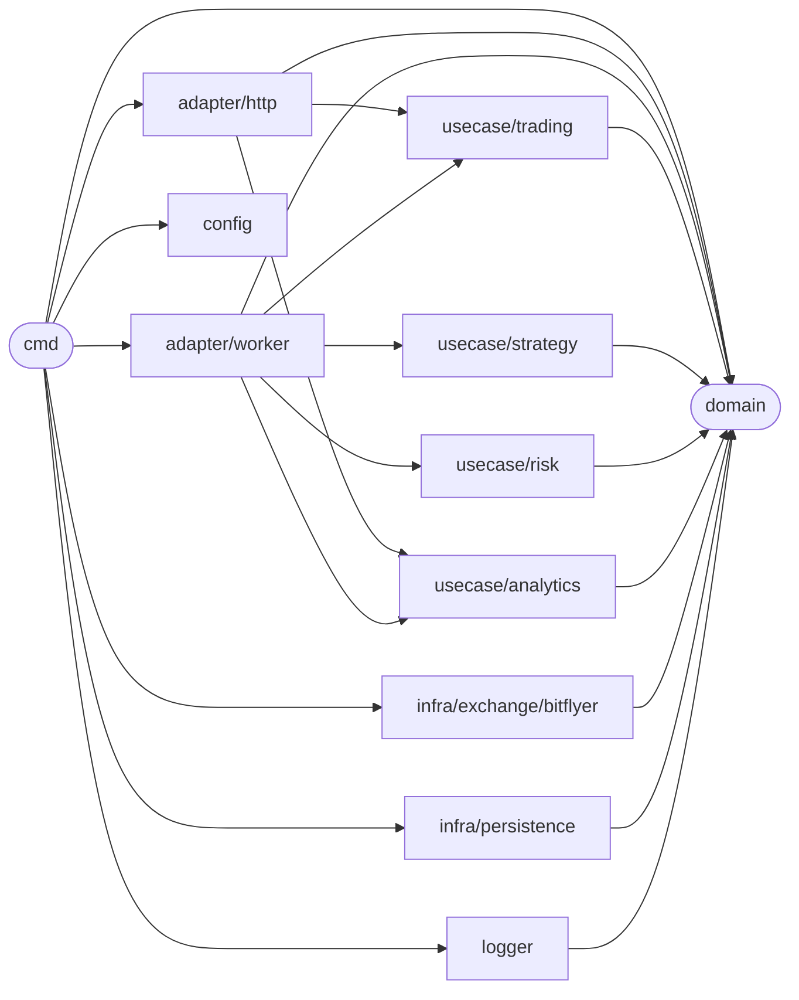
```mermaid
graph LR
    cmd([cmd])

    cmd --> adp_http[adapter/http]
    cmd --> adp_worker[adapter/worker]
    cmd --> infra_bf[infra/exchange/bitflyer]
    cmd --> infra_db[infra/persistence]
    cmd --> domain([domain])

    adp_http --> uc_trading[usecase/trading]
    adp_http --> uc_analytics[usecase/analytics]
    adp_http --> domain
    adp_worker --> uc_trading
    adp_worker --> uc_strategy[usecase/strategy]
    adp_worker --> uc_risk[usecase/risk]
    adp_worker --> domain

    uc_trading --> domain
    uc_strategy --> domain
    uc_risk --> domain
    uc_analytics[usecase/analytics] --> domain

    adp_worker --> uc_analytics

    infra_bf --> domain
    infra_db --> domain
    logger --> domain
    cmd --> config[config]
    cmd --> logger
```

### CI-enforced dependency rules

```bash
# Verify domain purity
grep -r '"github.com/bmf-san/gogocoin' internal/domain/ && exit 1 || true

# Verify usecase layer does not import infra
grep -rn '"github.com/bmf-san/gogocoin.*/infra/' internal/usecase/ && exit 1 || true

# Verify adapter layer does not import infra
grep -rn '"github.com/bmf-san/gogocoin.*/infra/' internal/adapter/ && exit 1 || true
```

---

## 8. Data Model and Database Design

### 8.1 Domain Model to DB Table Mapping

| Domain model | DB table | Notes |
|---|---|---|
| `Trade` | `trades` | `order_id` UNIQUE constraint. Idempotency guaranteed by bitFlyer order ID |
| `Position` | `positions` | `status` ∈ {OPEN, PARTIAL, CLOSED}. FIFO position management |
| `Balance` | `balances` | Snapshot history (append-only, never overwritten). Multiple rows per currency |
| `MarketData` | `market_data` | UNIQUE(symbol, timestamp). Unified tick + OHLCV model |
| `PerformanceMetric` | `performance_metrics` | Daily statistical snapshot calculated and appended after each trade |
| `LogEntry` | `logs` | `fields` column is JSON TEXT (structured log key-value pairs) |
| *(key/value)* | `app_state` | KV store for runtime flags such as `trading_enabled`. Fixed-key upserts |
| `OrderRequest` / `OrderResult` | **none** | In-memory only. Not persisted to DB |

### 8.2 E-R Diagram

> **No foreign key constraints — design rationale**
>
> The only cross-table logical reference is between `positions` and `trades`, but `PnLCalculator`
> writes both **within the same transaction** (BeginTx → SavePosition/UpdatePosition → SaveTrade → Commit).
> The atomicity of the transaction provides the same integrity guarantee as FK constraints, making DB-level FKs redundant.
>
> Additionally, SQLite ignores FK declarations unless `PRAGMA foreign_keys = ON` is explicitly set,
> making it easy to accidentally run with FKs declared but not enforced.
>
> **Compensating controls** (in place of FK constraints)
> - All cross-table writes complete within a single tx (PnLCalculator's responsibility)
> - `trades.order_id UNIQUE` constraint prevents duplicate writes
> - `MaintenanceWorker` deletes `trades` by `executed_at` and closed `positions` by `updated_at` based on `retention_days`. OPEN positions are never deleted.
>
> **Operational note**: When directly manipulating the DB with external tools or manual SQL, writes are performed without integrity checks. Always operate within a transaction.

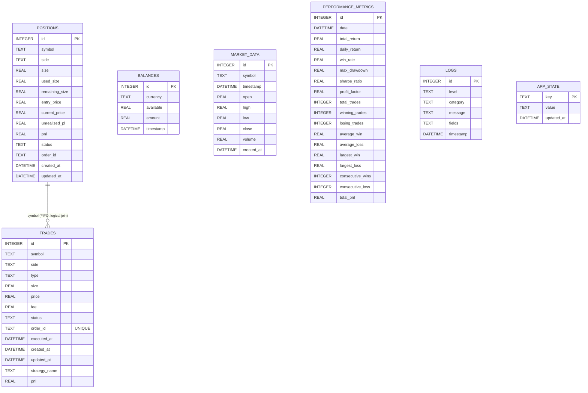
```mermaid
erDiagram
    TRADES {
        INTEGER id PK
        TEXT    symbol
        TEXT    side
        TEXT    type
        REAL    size
        REAL    price
        REAL    fee
        TEXT    status
        TEXT    order_id "UNIQUE"
        DATETIME executed_at
        DATETIME created_at
        DATETIME updated_at
        TEXT    strategy_name
        REAL    pnl
    }

    POSITIONS {
        INTEGER id PK
        TEXT    symbol
        TEXT    side
        REAL    size
        REAL    used_size
        REAL    remaining_size
        REAL    entry_price
        REAL    current_price
        REAL    unrealized_pl
        REAL    pnl
        TEXT    status
        TEXT    order_id
        DATETIME created_at
        DATETIME updated_at
    }

    BALANCES {
        INTEGER  id PK
        TEXT     currency
        REAL     available
        REAL     amount
        DATETIME timestamp
    }

    MARKET_DATA {
        INTEGER  id PK
        TEXT     symbol
        DATETIME timestamp
        REAL     open
        REAL     high
        REAL     low
        REAL     close
        REAL     volume
        DATETIME created_at
    }

    PERFORMANCE_METRICS {
        INTEGER  id PK
        DATETIME date
        REAL     total_return
        REAL     daily_return
        REAL     win_rate
        REAL     max_drawdown
        REAL     sharpe_ratio
        REAL     profit_factor
        INTEGER  total_trades
        INTEGER  winning_trades
        INTEGER  losing_trades
        REAL     average_win
        REAL     average_loss
        REAL     largest_win
        REAL     largest_loss
        INTEGER  consecutive_wins
        INTEGER  consecutive_loss
        REAL     total_pnl
    }

    LOGS {
        INTEGER  id PK
        TEXT     level
        TEXT     category
        TEXT     message
        TEXT     fields
        DATETIME timestamp
    }

    APP_STATE {
        TEXT     key PK
        TEXT     value
        DATETIME updated_at
    }

    POSITIONS ||--o{ TRADES : "symbol (FIFO, logical join)"
```

### 8.3 Table Design Rationale

#### `trades` — Fill records (immutable)

- `order_id UNIQUE`: Guarantees idempotent writes using the bitFlyer-issued order ID. Duplicate order processing cannot create duplicate records.
- `pnl`: Calculated by PnLCalculator on fill and written here. Result of FIFO calculation against `positions`.
- `strategy_name`: Records which strategy placed the order. Used for performance analysis.
- Records are **immutable** (never UPDATEd).

#### `positions` — Position management (FIFO)

- `size` / `used_size` / `remaining_size`: Created on BUY. `used_size` increases and `remaining_size` decreases on each SELL fill.
- `status` transitions: `OPEN` → `PARTIAL` (partial close) → `CLOSED` (fully closed).
- `UpdateStatus()` method automatically sets status based on `used_size` / `remaining_size` (domain logic).
- `order_id`: Corresponding BUY order ID (no FK; application-level reference).

#### `balances` — Balance snapshots

- **Append-only** (INSERT only, never overwritten). Balance history remains as a time series.
- One row per `currency` (e.g., `JPY`, `BTC`).
- Latest balance is retrieved with `SELECT MAX(id) FROM balances GROUP BY currency` (`GetLatestBalances` returns the latest row per currency).

#### `market_data` — Tick + OHLCV unified

- UNIQUE(symbol, timestamp): Prevents duplicate writes for the same symbol and timestamp.
- Tick data and OHLCV unified into a single `MarketData` model. WebSocket data is stored as received.
- `MaintenanceWorker` periodically deletes old data (retention period is configurable).

#### `logs` — Structured logs

- `fields` is JSON TEXT. `map[string]any` is `json.Marshal`ed before storage.
- Fast filtering via `idx_logs_timestamp` (`timestamp DESC`) and `idx_logs_category` indexes.
- Queried by REST API `/api/logs`.

#### `app_state` — Runtime flags

- KV store. Current keys:
  - `trading_enabled`: `"true"` / `"false"` (trading enabled/disabled flag)
- Used to restore state after application restart.

### 8.4 Migration Strategy

Migration files are managed in `internal/infra/persistence/schema/` with sequential numeric prefixes:

```
001_initial.sql    # Core tables (trades, positions, balances, market_data, performance_metrics, logs)
002_indexes.sql    # Query performance indexes
003_app_state.sql  # app_state table
004_performance_upsert.sql  # performance_metrics UPSERT support
```

`Migrate()` in the DB initialization code automatically applies all files in ascending order at startup.
Idempotency is ensured by `CREATE TABLE IF NOT EXISTS` / `CREATE INDEX IF NOT EXISTS`.
`ALTER TABLE` statements are not idempotent, so prefer designs that avoid them in new migrations, or introduce a migration history table to prevent double-application.
The next migration should start with `005_`.

### 8.5 Data Retention Policy

| Table | Retention policy |
|---|---|
| `trades` | `MaintenanceWorker` deletes records older than `retention_days` (by `executed_at`) |
| `positions` | `MaintenanceWorker` deletes closed positions older than `retention_days` (by `updated_at`). OPEN positions are never deleted |
| `balances` | `MaintenanceWorker` deletes records older than `retention_days` |
| `market_data` | `MaintenanceWorker` deletes records older than `retention_days` |
| `performance_metrics` | `MaintenanceWorker` deletes records older than `retention_days` (by `date`) |
| `logs` | `MaintenanceWorker` deletes records older than `retention_days` |
| `app_state` | Retained permanently (fixed keys, upsert only) |


---

## 9. Operational Stability Design

Design decisions for continuous 24/7 operation.

### 9.1 API Rate Limit Mitigation

The bitFlyer API has strict per-minute request limits, and balance queries are called frequently in the trading loop.

- **Balance cache (TTL: 10s)**: `balance` is cached in memory; no re-fetch within TTL. Significantly reduces 429 errors.
- **Rate limiter**: `infra/exchange/bitflyer/rate_limiter.go` controls requests per minute via `config.api.rate_limit.requests_per_minute`.

### 9.2 Deadlock Prevention

- **Per-resource lock design**: Minimum-granularity locks per resource. Trading state updates and balance updates use separate locks.
- **Cleanup concurrency safety**: SQLite WAL mode does not block readers and writers from each other. `MaintenanceWorker` DELETEs and `MarketDataWorker` INSERTs are safely concurrent due to SQLite transaction isolation. No additional application-level flags are needed.

### 9.3 Log Optimization

High-frequency DEBUG logs written directly to the DB would cause the log table to grow rapidly and degrade response times.

- **High-frequency message filtering**: In `logger/logger.go`'s `saveToDatabase()`, the following two conditions are individually checked and DB writes are skipped. stdout output continues unaffected.
  - **DEBUG level** (regardless of category)
  - **`data` category** (regardless of level — targets high-frequency tick data logs)
- **DB index optimization**: An index on `logs.timestamp DESC` is added for fast log API responses (latest N records) (`internal/infra/persistence/schema/002_indexes.sql`).

### 9.4 Resource Management

- **DB retention period**: `data_retention.retention_days` (default: 1 day) deletes old records daily. See [docs/DATA_MANAGEMENT.md](DATA_MANAGEMENT.md) for details.
- **Low resource consumption design**: Workers use goroutines + ticker-based loops to minimize CPU usage when idle.

---

## 10. API Specification

API endpoints and request/response details are managed in **[docs/openapi.yaml](openapi.yaml)** as the single source of truth.

DESIGN_DOC describes architectural decisions; API contract details are delegated to openapi.yaml.

### Code generation flow

```
docs/openapi.yaml
       │
       │  make generate
       │  (oapi-codegen v2)
       ▼
internal/adapter/http/api.gen.go   ← Auto-generated. Do not edit directly.
       │
       │  *Server implements StrictServerInterface
       ▼
internal/adapter/http/server.go / handler_*.go
```

| File | Role |
|---|---|
| `docs/openapi.yaml` | Single source of truth for the API contract |
| `internal/adapter/http/oapi-codegen.yaml` | oapi-codegen generation config |
| `internal/adapter/http/api.gen.go` | Generated types, interfaces, and routing |

**Operational rules**
- After modifying `docs/openapi.yaml`, always run `make generate` and commit the result.
- The CI `codegen` job verifies sync via `make generate-check` (re-generate → `git diff`).
- Never edit `api.gen.go` directly.

### 1.1 C4 Context — システム全体像

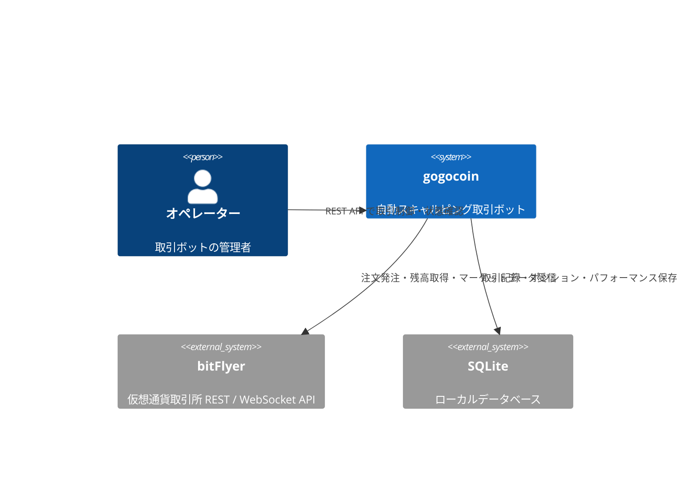
```mermaid
C4Context
    Person(operator, "オペレーター", "取引ボットの管理者")
    System(gogocoin, "gogocoin", "自動スキャルピング取引ボット")
    System_Ext(bitflyer, "bitFlyer", "仮想通貨取引所 REST / WebSocket API")
    System_Ext(sqlite, "SQLite", "ローカルデータベース")

    Rel(operator, gogocoin, "REST API で取引制御・状態確認")
    Rel(gogocoin, bitflyer, "注文発注・残高取得・マーケットデータ受信")
    Rel(gogocoin, sqlite, "取引記録・ポジション・パフォーマンス保存")
```

### 1.2 C4 Container — 主要コンテナ

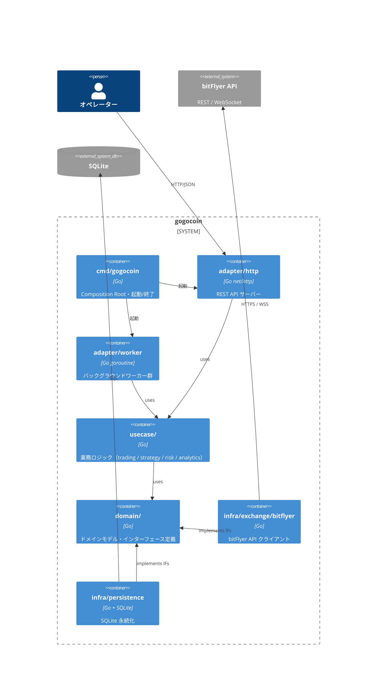
```mermaid
C4Container
    Person(operator, "オペレーター")

    System_Boundary(gogocoin, "gogocoin") {
        Container(cmd, "cmd/gogocoin", "Go", "Composition Root・起動/終了")
        Container(http, "adapter/http", "Go net/http", "REST API サーバー")
        Container(worker, "adapter/worker", "Go goroutine", "バックグラウンドワーカー群")
        Container(usecase, "usecase/", "Go", "業務ロジック（trading / strategy / risk / analytics）")
        Container(domain, "domain/", "Go", "ドメインモデル・インターフェース定義")
        Container(infra_bf, "infra/exchange/bitflyer", "Go", "bitFlyer API クライアント")
        Container(infra_db, "infra/persistence", "Go + SQLite", "SQLite 永続化")
    }

    System_Ext(bitflyer_api, "bitFlyer API", "REST / WebSocket")
    SystemDb_Ext(sqlite, "SQLite")

    Rel(operator, http, "HTTP/JSON")
    Rel(cmd, http, "起動")
    Rel(cmd, worker, "起動")
    Rel(http, usecase, "uses")
    Rel(worker, usecase, "uses")
    Rel(usecase, domain, "uses")
    Rel(infra_bf, domain, "implements IFs")
    Rel(infra_db, domain, "implements IFs")
    Rel(infra_bf, bitflyer_api, "HTTPS / WSS")
    Rel(infra_db, sqlite, "SQL")
```

### 1.3 C4 Component — usecase/trading

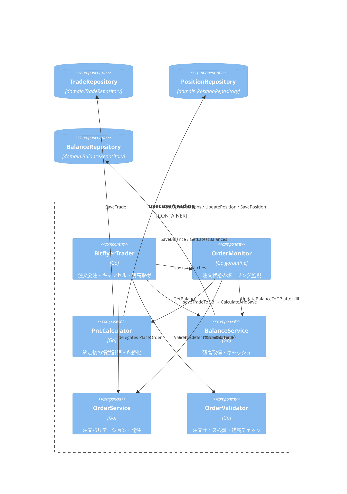
```mermaid
C4Component
    Container_Boundary(trading, "usecase/trading") {
        Component(trader, "BitflyerTrader", "Go", "注文発注・キャンセル・残高取得")
        Component(monitor, "OrderMonitor", "Go goroutine", "注文状態のポーリング監視")
        Component(pnl, "PnLCalculator", "Go", "約定後の損益計算・永続化")
        Component(balance, "BalanceService", "Go", "残高取得・キャッシュ")
        Component(order, "OrderService", "Go", "注文バリデーション・発注")
        Component(validator, "OrderValidator", "Go", "注文サイズ検証・残高チェック")
    }

    ComponentDb(tradeRepo, "TradeRepository", "domain.TradeRepository")
    ComponentDb(positionRepo, "PositionRepository", "domain.PositionRepository")
    ComponentDb(balanceRepo, "BalanceRepository", "domain.BalanceRepository")

    Rel(trader, monitor, "starts / watches")
    Rel(trader, order, "delegates PlaceOrder")
    Rel(trader, validator, "ValidateOrder / CheckBalance")
    Rel(monitor, order, "GetOrders（OrderGetter IF）")
    Rel(monitor, pnl, "saveTradeToDB → CalculateAndSave")
    Rel(monitor, balance, "UpdateBalanceToDB after fill")
    Rel(pnl, tradeRepo, "SaveTrade")
    Rel(pnl, positionRepo, "GetOpenPositions / UpdatePosition / SavePosition")
    Rel(trader, balance, "GetBalance")
    Rel(balance, balanceRepo, "SaveBalance / GetLatestBalances")
```

### 依存ルール

| ルール | 説明 |
|---|---|
| `domain/` は内部importゼロ | stdlibのみ。インフラもusecaseも知らない |
| `usecase/` は `infra/` をimportしない | `domain/` interfaceにのみ依存する |
| `adapter/` は `infra/` の具体型を持たない | `domain/` interfaceのみ使用 |
| `infra/` は `domain/` を実装する | `usecase/` や `adapter/` は知らない |
| `cmd/` のみが全パッケージを組み合わせる | Composition Rootとして唯一の例外 |

---

## 2. ディレクトリ構造

```
gogocoin/
├── cmd/
│   └── gogocoin/
│       ├── main.go           # シグナル処理・起動/終了のみ（〜50行）
│       ├── bootstrap.go      # 全サービスの組み立て（Composition Root）
│       └── trading_ctrl.go   # TradingController
├── internal/
│   ├── domain/               # Layer 0: モデル + インターフェース定義
│   │   ├── trade.go
│   │   ├── position.go
│   │   ├── order.go
│   │   ├── balance.go
│   │   ├── market_data.go
│   │   ├── performance.go
│   │   ├── log.go
│   │   ├── repository.go     # 永続化インターフェース群
│   │   ├── service.go        # 共通サービスIF（MarketSpecService等）
│   │   └── errors.go         # sentinelエラー定義
│   │
│   ├── usecase/              # Layer 1: 業務ロジック（インフラ非依存）
│   │   ├── trading/
│   │   │   ├── interfaces.go
│   │   │   ├── trader.go
│   │   │   ├── balance/
│   │   │   ├── pnl/
│   │   │   ├── monitor/
│   │   │   ├── order/
│   │   │   └── validator/
│   │   ├── risk/
│   │   └── analytics/
│   │
│   ├── adapter/              # Layer 2: 入出力アダプタ
│   │   ├── http/             # REST APIサーバー
│   │   │   ├── server.go             # HTTPサーバー・ルーティング登録
│   │   │   ├── handler_control.go    # 取引制御ハンドラ（start/stop）
│   │   │   ├── handler_data.go       # データ取得ハンドラ（market/trades/positions等）
│   │   │   ├── handler_status.go     # ステータス確認ハンドラ
│   │   │   ├── contracts.go          # TradingStateController 等 consumer-driven IF
│   │   │   ├── api.gen.go            # oapi-codegenが生成（直接編集禁止）
│   │   │   └── oapi-codegen.yaml     # コード生成設定
│   │   └── worker/           # バックグラウンドワーカー群
│   │       ├── contracts.go          # Worker / HealthChecker / Stoppable IF
│   │       ├── manager.go            # WorkerManager（全worker起動・停止・ヘルス管理）
│   │       ├── market_data.go        # MarketDataWorker
│   │       ├── strategy_worker.go    # StrategyWorker
│   │       ├── signal_worker.go      # SignalWorker
│   │       ├── maintenance.go        # MaintenanceWorker
│   │       └── strategy_monitor.go   # StrategyMonitorWorker
│   │
│   ├── infra/                # Layer 3: インフラ実装
│   │   ├── exchange/
│   │   │   └── bitflyer/     # bitFlyer APIクライアント
│   │   └── persistence/      # SQLite永続化
│   │       ├── db.go                 # DB接続のみ
│   │       ├── migrate.go            # マイグレーション適用
│   │       ├── repository.go         # RepositoryFacade（全リポジトリ集約）
│   │       ├── transaction.go        # TransactionManager 実装
│   │       ├── trade_repo.go
│   │       ├── position_repo.go
│   │       ├── balance_repo.go
│   │       ├── market_data_repo.go
│   │       ├── performance_repo.go
│   │       ├── log_repo.go
│   │       ├── app_state_repo.go
│   │       ├── maintenance_repo.go
│   │       └── schema/               # マイグレーションSQL
│   │
│   ├── config/               # 横断的関心事（設定読み込み・バリデーション）
│   └── logger/               # 横断的関心事（構造化ログ・DB統合）
│
├── pkg/                      # 公開API（セマンティックバージョニング対象）
│   ├── engine/
│   │   ├── engine.go         # Run() / RunWithLogger()
│   │   └── options.go        # WithStrategy() / WithConfigPath()
│   └── strategy/
│       ├── strategy.go       # Strategy インターフェース
│       ├── signal.go         # Signal 型（BUY / SELL / HOLD）
│       ├── market_data.go    # MarketData 型
│       ├── metrics.go        # StrategyMetrics / StrategyStatus 型
│       ├── base.go           # BaseStrategy（共通フィールド・デフォルト実装）
│       ├── registry.go       # Registry（ctor 登録・取得）
│       └── scalping/         # 同梱デフォルト戦略
```

---

## 3. インターフェース設計

### 定義箇所の原則

| 種類 | 定義場所 | 例 |
|---|---|---|
| データ永続化のIF | `domain/repository.go` | `TradeRepository`, `PositionRepository` |
| 複数パッケージで使う共通サービスIF | `domain/service.go` | `MarketSpecService` |
| 特定サービス間の振る舞いIF | consumer-driven（使う側packageで定義） | `worker.RiskChecker`, `http.TradingStateController` |

### `domain/service.go`

```go
package domain

// MarketSpecService provides exchange-specific market specifications.
type MarketSpecService interface {
    GetMinimumOrderSize(symbol string) (float64, error)
}
```

### `domain/errors.go` のエラー定義

現在の `domain/errors.go` は `ErrType` 分類と `Unwrap()` を持つ構造体ベースの `*Error` を使用する。

```go
// ErrType でエラーカテゴリを分類
const (
    ErrTypeRateLimit ErrType = "rate_limit"
    ErrTypeNetwork   ErrType = "network"
    // ...
)

// sentinel は *domain.Error 型
var ErrRateLimitExceeded = NewError(ErrTypeRateLimit, "rate limit exceeded", nil)

// 呼び出し側は errors.As() で型変換して ErrType を確認する
if apiErr := new(domain.Error); errors.As(err, &apiErr) {
    if apiErr.Type == domain.ErrTypeRateLimit { /* handle */ }
}
```

`infra/exchange/bitflyer/` は `domain.ErrRateLimitExceeded` を直接返すかラップして返す。
`usecase/` と `adapter/` は `errors.As()` で `*domain.Error` に変換し `ErrType` で判定することで、bitflyer パッケージを知らずにエラー分類できる。

---

## 4. コンポーネント設計

### 4.1 Composition Root（`cmd/gogocoin/`）

`cmd/gogocoin/` がアプリケーション内の唯一のwiring層（Composition Root）。

```
cmd/gogocoin/
  main.go          # シグナル処理とbootstrap.Run()の呼び出しのみ
  bootstrap.go     # 全サービスの初期化と依存注入
  trading_ctrl.go  # TradingControllerの実装
```

`main.go` の責務はシグナル捕捉と `bootstrap.Run(ctx)` の呼び出しのみ（〜50行）。

`bootstrap.go` がすべてのサービスを組み立てる唯一の場所：

```go
// bootstrap.go のイメージ
db, _        := persistence.NewDB(cfg.Database.Path)
tradeRepo    := persistence.NewTradeRepository(db)
positionRepo := persistence.NewPositionRepository(db)
// db は TransactionManager も実装する（BeginTx）
pnlCalc := pnl.NewCalculator(tradeRepo, positionRepo, db, log, strategyName)
trader  := trading.NewBitflyerTrader(bfClient, pnlCalc, log)
// ...
```

bitFlyer WebSocket の再接続ロジックも `bootstrap.go` が担う。
`usecase/` 層は接続管理を知らない。

```go
// bootstrap.go のイメージ（再接続ループ）
go func() {
    for {
        if err := ws.Connect(ctx); err != nil {
            if ctx.Err() != nil { return }
        }
        // 正常切断・エラー切断いずれの場合も同じインターバルで再接続
        if ctx.Err() != nil { return }
        time.Sleep(reconnectInterval)
    }
}()
```

### 4.2 TradingController（`cmd/gogocoin/trading_ctrl.go`）

取引の有効/無効状態を管理する。インターフェースは各 adapter パッケージで
consumer-driven に定義し、`cmd/gogocoin/trading_ctrl.go` が実装を提供する。
adapter 層が cmd 層を直接参照しない依存方向を守るための構造。

```go
// adapter/http/contracts.go（consumer-driven）
type TradingStateController interface {
    IsTradingEnabled() bool
    SetTradingEnabled(ctx context.Context, enabled bool) error
}

// adapter/worker/contracts.go（consumer-driven）
type TradingStateReader interface {
    IsTradingEnabled() bool
}

// cmd/gogocoin/trading_ctrl.go（唯一の実装）
type TradingController struct {
    mu      sync.RWMutex
    enabled bool
    db      domain.AppStateRepository
    logger  logger.LoggerInterface
}

func (tc *TradingController) IsTradingEnabled() bool
func (tc *TradingController) SetTradingEnabled(ctx context.Context, enabled bool) error
```

`cmd/bootstrap.go` 起動時に DB から `trading_enabled` を読み込み、`enabled` フィールドを初期化する。
再起動後も前回の取引状態を引き継ぐ。

`cmd/bootstrap.go` が `*TradingController` を生成し、`adapter/http.Server` と
`adapter/worker.SignalWorker` にそれぞれのインターフェース型で注入する。

### 4.3 persistence（`infra/persistence/`）

#### 集約の設計根拠

`domain/` のリポジトリインターフェースは**集約境界**に基づいて定義する。

| 集約ルート | ライフサイクル | リポジトリIF |
|---|---|---|
| `Trade` | 約定で生成。不変。 | `TradeRepository` |
| `Position` | BUY で生成、複数の SELL で更新（FIFO）、CLOSED で終了。`Trade` とは独立したライフサイクル。 | `PositionRepository` |
| `Balance` | 残高スナップショット。注文完了時にスナップショットを追記（INSERT only）。読み取りは最新スナップショット取得のみ。 | `BalanceRepository`（SaveBalance / GetLatestBalances） |
| `MarketData` | 時系列データ。ワーカーが継続書き込み。REST API からの読み取りも可。 | `MarketDataRepository` |
| `PerformanceMetric` | 各取引後の統計スナップショット。最新値取得も担う。 | `PerformanceRepository`（SavePerformanceMetric / GetLatestPerformanceMetric） |
| `PerformanceMetric`（分析） | 日次集計の読み取り専用。書き込みは `PerformanceRepository` に委譲。 | `AnalyticsRepository`（GetPerformanceMetrics(days int) のみ）· **consumer-driven、usecase/analytics 内に定義** |
| `LogEntry` | アプリケーションイベントの永続化。REST API `GET /api/logs` からの読み取りも提供する。 | `LogRepository`（SaveLog / GetRecentLogsWithFilters） |
| `AppState` | KVストア。インフラ的関心事。 | `AppStateRepository` |

PnL Calculator は Trade・Position を**集約横断でアトミックに更新する**ユースケース。
これは `domain.TradingRepository` 複合IFではなく、**個別のリポジトリ + `TransactionManager`** を分けて受け取る設計とする。
`domain.TradingRepository` 複合IFは廃止する。

```go
// usecase/trading/pnl/calculator.go
func NewCalculator(
    tradeRepo    domain.TradeRepository,
    positionRepo domain.PositionRepository,
    txMgr        domain.TransactionManager,  // BeginTx() で Trade+Position をアトミック保存
    log          logger.LoggerInterface,
    strategyName string,
) *Calculator
```

> **注**: `BalanceRepository` は PnL Calculator の責務外。残高更新は `OrderMonitor` が
> `BalanceUpdater.UpdateBalanceToDB()` 経由で行う（PnL 保存完了後）。

`cmd/bootstrap.go` でそれぞれ独立した実装を生成して注入する。
複合IFへの詰め替えは不要。

#### 実装構造

DB接続（`db.go`）とrepository実装を分離する。
各repository構造体は `*DB` を受け取り、`domain/repository.go` のインターフェースを実装する。

```go
// db.go: 接続管理 + TransactionManager + DatabaseLifecycle 実装
type DB struct{ conn *sql.DB }
func (db *DB) Close() error                          // domain.DatabaseLifecycle
func (db *DB) Ping() error                           // domain.DatabaseLifecycle
func (db *DB) BeginTx() (domain.Transaction, error)  // domain.TransactionManager

// trade_repo.go
type TradeRepository struct{ db *DB }
func NewTradeRepository(db *DB) *TradeRepository
func (r *TradeRepository) SaveTrade(trade *domain.Trade) error
func (r *TradeRepository) GetRecentTrades(limit int) ([]domain.Trade, error)
```

同様に `PositionRepository`, `BalanceRepository`, `MarketDataRepository`,
`PerformanceRepository`, `LogRepository`, `AppStateRepository`, `MaintenanceRepository`
をそれぞれ独立した構造体として定義する。

`TransactionManager` は `*persistence.DB` が直接実装する（`domain.Transaction` 返却）。

### 4.4 usecase/risk

`risk.Manager` は `config` パッケージに依存しない。`config.RiskManagementConfig` と `config.TradingConfig` から必要なフィールドを抽出した独自パラメータ型を使う（§4.5 strategy と同パターン）。

balance取得には consumer-driven のローカルインターフェースを使用し、`usecase/trading` への依存を持たない。
`TradingRepository` / `AnalyticsRepository` も consumer-driven の local IF として定義する。

```go
// usecase/risk/manager.go

// ManagerConfig はリスク管理パラメータ。config パッケージに依存しない。
// cmd/bootstrap.go で config.RiskManagementConfig / config.TradingConfig から変換して注入する。
type ManagerConfig struct {
    MaxTotalLossPercent   float64
    MaxTradeLossPercent   float64
    MaxDailyLossPercent   float64
    MaxTradeAmountPercent float64
    MaxDailyTrades        int
    MinTradeInterval      time.Duration
    FeeRate               float64
    InitialBalance        float64
}

// TradingRepository は直近トレード取得に必要な最小 IF
type TradingRepository interface {
    GetRecentTrades(limit int) ([]domain.Trade, error)
}

// AnalyticsRepository はパフォーマンス集計取得に必要な最小 IF
type AnalyticsRepository interface {
    GetPerformanceMetrics(days int) ([]domain.PerformanceMetric, error)
}

type Manager struct {
    cfg           ManagerConfig
    tradingRepo   TradingRepository
    analyticsRepo AnalyticsRepository
    trader        trading.Trader
    logger        logger.LoggerInterface
}
```

---

## 5. プラガブル戦略アーキテクチャ（`pkg/`）

gogocoin はリポジトリ利用者が独自の取引戦略を差し込めるよう、**`pkg/`** 以下に公開 API を提供する。
`internal/` は外部からインポート不可だが、`pkg/` はセマンティックバージョニング対象の安定 API として扱う。

```
pkg/
├── engine/
│   ├── engine.go   # Run() / RunWithLogger()
│   └── options.go  # WithStrategy() / WithConfigPath()
└── strategy/
    ├── strategy.go     # Strategy インターフェース
    ├── signal.go       # Signal 型（BUY / SELL / HOLD）
    ├── market_data.go  # MarketData 型
    ├── metrics.go      # StrategyMetrics / StrategyStatus 型
    ├── base.go         # BaseStrategy（共通フィールド・デフォルト実装）
    ├── registry.go     # Registry（ctor 登録・取得）
    └── scalping/       # 同梱デフォルト戦略
```

### 5.1 `pkg/strategy.Strategy` インターフェース

```go
type Strategy interface {
    // シグナル生成
    GenerateSignal(ctx context.Context, data *MarketData, history []MarketData) (*Signal, error)
    Analyze(data []MarketData) (*Signal, error)

    // ライフサイクル
    Start(ctx context.Context) error
    Stop(ctx context.Context) error
    IsRunning() bool
    GetStatus() StrategyStatus
    Reset() error

    // メトリクス・取引カウント
    GetMetrics() StrategyMetrics
    RecordTrade()
    InitializeDailyTradeCount(count int)

    // 設定
    Name() string
    Description() string
    Version() string
    Initialize(config map[string]interface{}) error   // config.yaml の strategy_params.<name> ブロックを受け取る
    UpdateConfig(config map[string]interface{}) error
    GetConfig() map[string]interface{}
}
```

### 5.2 カスタム戦略の実装手順

**1. 別リポジトリを作成し、gogocoin を `go.mod` に追加する**

```bash
go get github.com/bmf-san/gogocoin@latest
```

**2. `pkg/strategy.BaseStrategy` を埋め込んで戦略を実装する**

`BaseStrategy` はライフサイクル（Start/Stop/IsRunning/GetStatus/Reset）・カウント
（RecordTrade/InitializeDailyTradeCount）・メトリクスのデフォルト実装を提供する。

```go
package mystrategy

import (
    "context"

    "github.com/bmf-san/gogocoin/pkg/strategy"
)

type MyStrategy struct {
    strategy.BaseStrategy
    // 戦略固有フィールド
}

func New() strategy.Strategy { return &MyStrategy{} }

func (s *MyStrategy) Name() string        { return "mystrategy" }
func (s *MyStrategy) Description() string { return "My custom strategy" }
func (s *MyStrategy) Version() string     { return "0.1.0" }

func (s *MyStrategy) Initialize(cfg map[string]interface{}) error {
    // config.yaml の strategy_params.mystrategy ブロックを受け取る
    return nil
}

func (s *MyStrategy) UpdateConfig(cfg map[string]interface{}) error { return s.Initialize(cfg) }
func (s *MyStrategy) GetConfig() map[string]interface{}             { return nil }

func (s *MyStrategy) GenerateSignal(
    ctx context.Context,
    data *strategy.MarketData,
    history []strategy.MarketData,
) (*strategy.Signal, error) {
    // シグナルロジック
    return &strategy.Signal{Action: strategy.Hold}, nil
}

func (s *MyStrategy) Analyze(data []strategy.MarketData) (*strategy.Signal, error) {
    return &strategy.Signal{Action: strategy.Hold}, nil
}
```

**3. `engine.Run()` でエントリポイントを実装する**

```go
package main

import (
    "context"
    "os"
    "os/signal"
    "syscall"

    "github.com/bmf-san/gogocoin/pkg/engine"
    pkgstrategy "github.com/bmf-san/gogocoin/pkg/strategy"
    "example.com/myrepo/mystrategy"
)

func main() {
    ctx, stop := signal.NotifyContext(context.Background(), os.Interrupt, syscall.SIGTERM)
    defer stop()

    if err := engine.Run(ctx,
        engine.WithStrategy("mystrategy", func() pkgstrategy.Strategy { return mystrategy.New() }),
        engine.WithConfigPath("./configs/config.yaml"),
    ); err != nil {
        os.Exit(1)
    }
}
```

**4. `config.yaml` で戦略名を指定する**

```yaml
trading:
  strategy:
    name: "mystrategy"   # WithStrategy() の第1引数と一致させる

strategy_params:
  mystrategy:            # Initialize() に渡される map のキー
    my_param: 42
```

### 5.3 `pkg/engine.Run()` の内部フロー

```
engine.Run(ctx, opts...)
  └─ config.Load()                    # configPath を読み込む
  └─ logger.New()                     # 構造化ロガーを初期化
  └─ run(ctx, cfg, log, ec)
       ├─ persistence.NewDB()         # SQLite 接続・マイグレーション
       ├─ bitflyer.NewClient()        # bitFlyer API クライアント
       ├─ registry.Get(cfg.trading.strategy.name)
       │    └─ Constructor()          # WithStrategy() で登録した ctor を呼ぶ
       ├─ strategy.Initialize(strategyParams)
       ├─ WorkerManager.Start()       # MarketDataWorker / StrategyWorker 等を起動
       ├─ HTTPServer.Start()          # REST API + Web UI
       └─ <ctx.Done()> → graceful shutdown
```

### 5.4 同梱戦略: `pkg/strategy/scalping`

EMAクロスオーバー + RSI フィルタによるスキャルピング戦略。
`engine.WithStrategy("scalping", scalping.NewDefault)` で登録する。
詳細パラメータは [pkg/strategy/scalping/README.md](../pkg/strategy/scalping/README.md) を参照。

### 4.6 WorkerManager（`adapter/worker/`）

`WorkerManager` はすべてのバックグラウンドワーカーのライフサイクルを管理する。
`cmd/bootstrap.go` がワーカーを生成して `WorkerManager` に登録し、一括起動・停止する。

```go
// adapter/worker/contracts.go
type Worker interface {
    Run(ctx context.Context) error  // blocking until ctx is cancelled
    Name() string
}

// HealthStatus はワーカーの稼働状態を表す。
type HealthStatus struct {
    Running   bool
    LastError error
    LastCheck time.Time
}

// adapter/worker/manager.go
type WorkerManager struct {
    workers      map[string]Worker
    workerOrder  []string  // 登録順を保持。StartAll はこの順序でgoroutineを起動する
    logger       logger.LoggerInterface
    // ...
}

func NewWorkerManager(logger logger.LoggerInterface) *WorkerManager
func (m *WorkerManager) Register(name string, worker Worker) error  // 重複名はエラー。StartAll 後の登録もエラー。
func (m *WorkerManager) StartAll(ctx context.Context) error
func (m *WorkerManager) StopAll() error
func (m *WorkerManager) HealthCheck() map[string]HealthStatus
```

登録されるワーカー一覧:

| ワーカー | 役割 |
|---|---|
| `MarketDataWorker` | WebSocketからtickデータを受信しDBに保存 |
| `StrategyWorker` | marketDataChを受信しシグナルを生成・エンジンレベルのストップロスを強制適用してsignalChに送信 |
| `SignalWorker` | signalChから受信しリスクチェック・発注を実行 |
| `MaintenanceWorker` | 定期的に古いデータをDB上からクリーンアップ |
| `StrategyMonitorWorker` | 戦略ヘルスを5分ごとに確認 |

### 4.7 logger

すべてのWorker constructorは `logger.LoggerInterface` を受け取る。
`*logger.Logger` への型アサートは行わない。

`logger.LoggerInterface` は以下のメソッドを持つ：
- **カテゴリロガー**: `System()`, `Trading()`, `API()`, `Strategy()`, `UI()`, `Data()`, `Category(string)`
- **フィールドヘルパー**: `WithFields()`, `WithField()`, `WithError()`
- **専用ログメソッド**: `LogTrade()`, `LogAPICall()`, `LogStrategySignal()`, `LogError()`, `LogPerformance()`, `LogStartup()`, `LogShutdown()`
- **基本メソッド**: `Error(msg string)`
- **ライフサイクル**: `Flush()`, `Close() error`, `SetLevel() error`, `GetLevel() string`
- **DB統合**: `SetDatabase(domain.LogRepository)`

テスト用のmock実装は `logger/testing.go` に一元管理する。
各パッケージのテストはこれをimportして使う（stdlibの `net/http/httptest` に倣うパターン）。

```go
// logger/testing.go
package logger

import (
    "io"
    "log/slog"

    "github.com/bmf-san/gogocoin/v1/internal/domain"
)

// nopSlog は io.Discard 向けの no-op slog.Logger。WithFields 等の戻り値に使用する。
// nil を返すと呼び出し元で Info() 等を呼んだ際にパニックするため、
// discard ハンドラの Logger を返すことで安全なメソッドチェーンを保証する。
var nopSlog = slog.New(slog.NewTextHandler(io.Discard, nil))

// NopLogger は何も出力しないテスト用実装。
// LoggerInterface の全メソッドを実装する。
type NopLogger struct{}

func (n *NopLogger) System() *ExtendedLogger                                                     { return &NopExtendedLogger{} }
func (n *NopLogger) Trading() *ExtendedLogger                                                    { return &NopExtendedLogger{} }
func (n *NopLogger) API() *ExtendedLogger                                                        { return &NopExtendedLogger{} }
func (n *NopLogger) Strategy() *ExtendedLogger                                                   { return &NopExtendedLogger{} }
func (n *NopLogger) UI() *ExtendedLogger                                                         { return &NopExtendedLogger{} }
func (n *NopLogger) Data() *ExtendedLogger                                                       { return &NopExtendedLogger{} }
func (n *NopLogger) Category(category string) *ExtendedLogger                                    { return &NopExtendedLogger{} }
func (n *NopLogger) WithFields(fields map[string]any) *slog.Logger                               { return nopSlog }
func (n *NopLogger) WithField(key string, value any) *slog.Logger                                { return nopSlog }
func (n *NopLogger) WithError(err error) *slog.Logger                                            { return nopSlog }
func (n *NopLogger) LogTrade(action, symbol string, price, qty float64, f map[string]any)        {}
func (n *NopLogger) LogAPICall(method, ep string, dur int64, code int, err error)                {}
func (n *NopLogger) LogStrategySignal(strategy, sym, action string, s float64, m map[string]any) {}
func (n *NopLogger) LogError(cat, op string, err error, f map[string]any)                        {}
func (n *NopLogger) LogPerformance(op string, dur int64, f map[string]any)                       {}
func (n *NopLogger) LogStartup(version string, config map[string]any)                            {}
func (n *NopLogger) LogShutdown(reason string)                                                   {}
func (n *NopLogger) Error(msg string)                                                            {}
func (n *NopLogger) SetDatabase(db domain.LogRepository)                                         {}
func (n *NopLogger) Flush()                                                                      {}
func (n *NopLogger) Close() error                                                                { return nil }
func (n *NopLogger) SetLevel(level string) error                                                 { return nil }
func (n *NopLogger) GetLevel() string                                                            { return "" }

var _ LoggerInterface = (*NopLogger)(nil) // compile-time check
```

> カテゴリロガーメソッド（`System()` 等）は `nil` ではなく `&NopExtendedLogger{}` を返す。
> `WithFields` / `WithField` / `WithError` は `nil` ではなく `nopSlog`（`io.Discard` 向け `*slog.Logger`）を返す。
> これにより `n.System().Info(...)` や `n.WithField("k", "v").Info(...)` 等のメソッドチェーンを安全に呼び出せる。
> `NopExtendedLogger` は `*ExtendedLogger` の全メソッドを no-op で実装した専用型とする。
> `var _ LoggerInterface = (*NopLogger)(nil)` のコンパイル時チェックで網羅性を保証する。

### 4.8 usecase/analytics

パフォーマンス指標の集計・分析を担うユースケース層。

`PerformanceRepository`（書き込み・最新値取得フロー）とは独立した、外部向け読み取り専用のユースケース。
`adapter/http` の `/api/performance` エンドポイントから呼ばれる。

```go
// usecase/analytics/analyzer.go

// AnalyticsRepository は読み取り専用の consumer-driven IF。
// domain.PerformanceRepository との書き込み競合を避けるため分離する。
type AnalyticsRepository interface {
    GetPerformanceMetrics(days int) ([]domain.PerformanceMetric, error)
}

type Analyzer struct {
    repo   AnalyticsRepository
    logger logger.LoggerInterface
}

func NewAnalyzer(repo AnalyticsRepository, log logger.LoggerInterface) *Analyzer
func (a *Analyzer) GetMetrics(ctx context.Context, days int) ([]domain.PerformanceMetric, error)
```

`cmd/bootstrap.go` では `infra/persistence.PerformanceRepository`（`PerformanceRepository` と `AnalyticsRepository` の両インターフェースを実装）を生成し、それぞれの用途に注入する。

---

## 5. ユースケース図

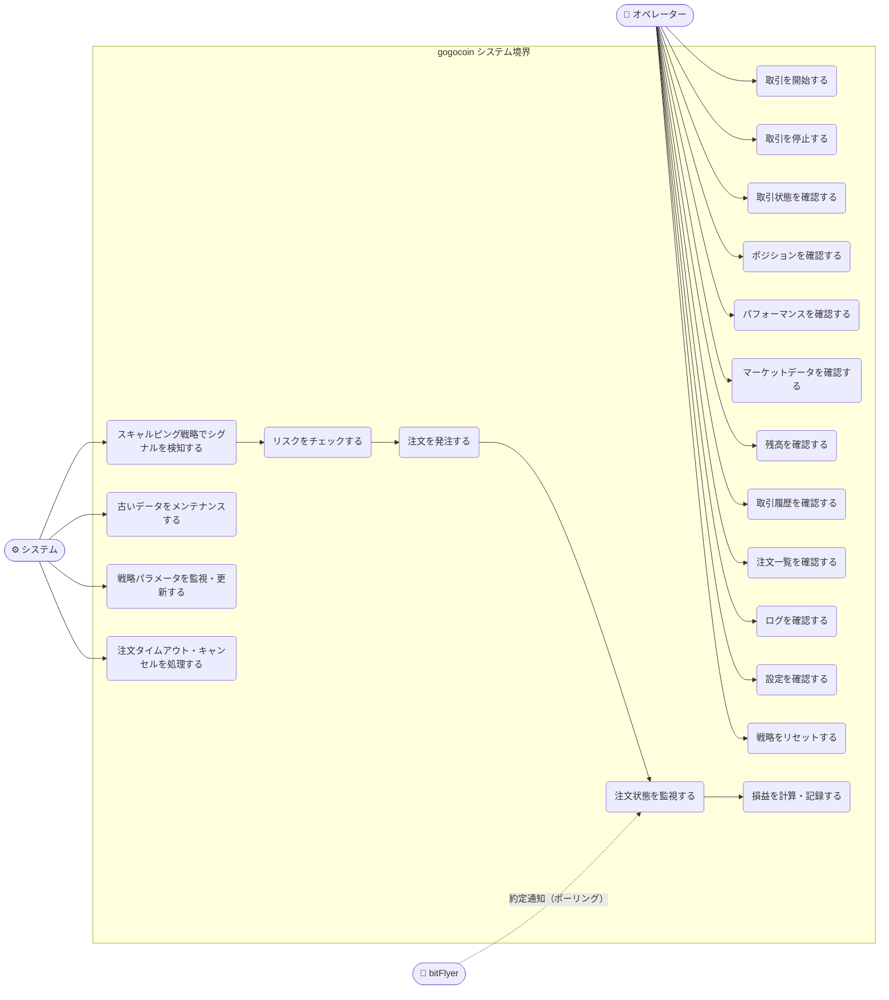
```mermaid
graph LR
    OP(["👤 オペレーター"])
    BF(["🏦 bitFlyer"])
    SYS(["⚙️ システム"])

    subgraph sys["gogocoin システム境界"]
        UC1(取引を開始する)
        UC2(取引を停止する)
        UC3(取引状態を確認する)
        UC4(ポジションを確認する)
        UC5(パフォーマンスを確認する)
        UC6(マーケットデータを確認する)
        UC7(残高を確認する)
        UC8(取引履歴を確認する)
        UC9(注文一覧を確認する)
        UC10(ログを確認する)
        UC11(設定を確認する)
        UC12(戦略をリセットする)
        UC13(スキャルピング戦略でシグナルを検知する)
        UC14(リスクをチェックする)
        UC15(注文を発注する)
        UC16(注文状態を監視する)
        UC17(損益を計算・記録する)
        UC18(古いデータをメンテナンスする)
        UC19(戦略パラメータを監視・更新する)
        UC20(注文タイムアウト・キャンセルを処理する)
    end

    OP --> UC1
    OP --> UC2
    OP --> UC3
    OP --> UC4
    OP --> UC5
    OP --> UC6
    OP --> UC7
    OP --> UC8
    OP --> UC9
    OP --> UC10
    OP --> UC11
    OP --> UC12
    UC13 --> UC14
    UC14 --> UC15
    UC15 --> UC16
    UC16 --> UC17
    BF -.->|"約定通知（ポーリング）"| UC16
    SYS --> UC13
    SYS --> UC18
    SYS --> UC19
    SYS --> UC20
```

---

## 6. シーケンス図

### 6.1 スキャルピング取引フロー

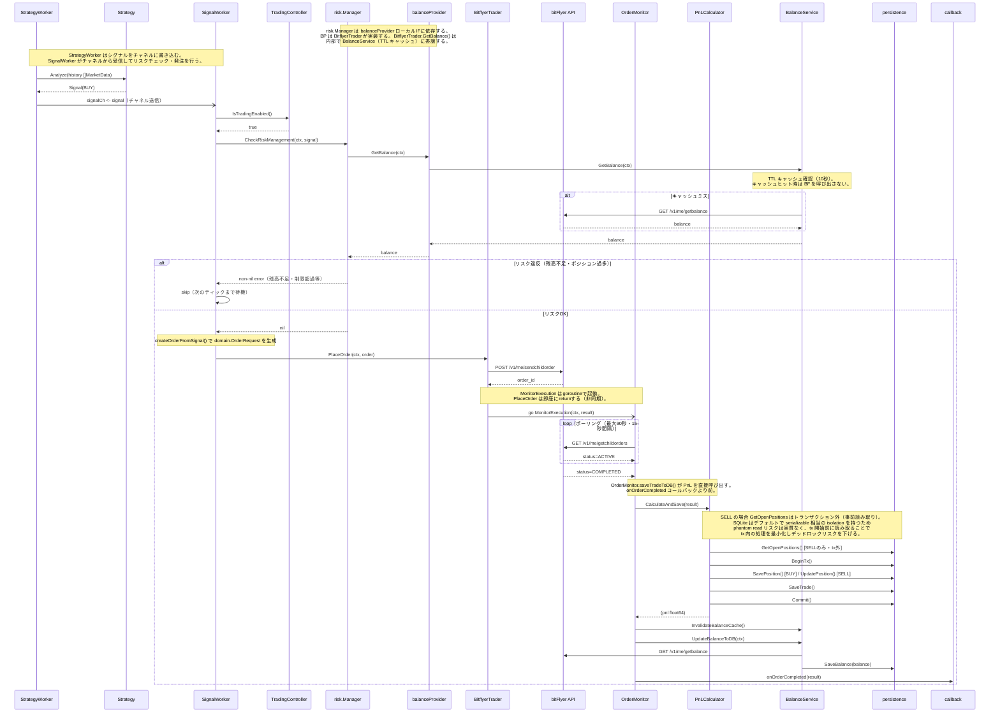
```mermaid
sequenceDiagram
    participant SW as StrategyWorker
    participant ST as Strategy
    participant SigW as SignalWorker
    participant TC as TradingController
    participant RM as risk.Manager
    participant BP as balanceProvider
    participant TR as BitflyerTrader
    participant BF as bitFlyer API
    participant OM as OrderMonitor
    participant PNL as PnLCalculator
    participant BS as BalanceService
    participant DB as persistence
    participant CB as callback

    note over RM,BP: risk.Manager は balanceProvider ローカルIFに依存する。<br/>BP は BitflyerTrader が実装する。BitflyerTrader.GetBalance() は<br/>内部で BalanceService（TTL キャッシュ）に委譲する。
    note over SW,SigW: StrategyWorker はシグナルをチャネルに書き込む。<br/>SignalWorker がチャネルから受信してリスクチェック・発注を行う。

    SW->>ST: Analyze(history []MarketData)
    ST-->>SW: Signal(BUY)
    SW-)SigW: signalCh <- signal（チャネル送信）
    SigW->>TC: IsTradingEnabled()
    TC-->>SigW: true
    SigW->>RM: CheckRiskManagement(ctx, signal)
    RM->>BP: GetBalance(ctx)
    BP->>BS: GetBalance(ctx)
    note over BS: TTL キャッシュ確認（10秒）。<br/>キャッシュヒット時は BF を呼び出さない。
    alt キャッシュミス
        BS->>BF: GET /v1/me/getbalance
        BF-->>BS: balance
    end
    BS-->>BP: balance
    BP-->>RM: balance
    alt リスク違反（残高不足・ポジション過多）
        RM-->>SigW: non-nil error（残高不足・制限超過等）
        SigW->>SigW: skip（次のティックまで待機）
    else リスクOK
        RM-->>SigW: nil
        note over SigW: createOrderFromSignal() で domain.OrderRequest を生成
        SigW->>TR: PlaceOrder(ctx, order)
        TR->>BF: POST /v1/me/sendchildorder
        BF-->>TR: order_id
        note over TR,OM: MonitorExecution はgoroutineで起動。<br/>PlaceOrder は即座にreturnする（非同期）。
        TR-)OM: go MonitorExecution(ctx, result)

        loop ポーリング（最大90秒・15秒間隔）
            OM->>BF: GET /v1/me/getchildorders
            BF-->>OM: status=ACTIVE
        end

        BF-->>OM: status=COMPLETED
        note over OM,PNL: OrderMonitor.saveTradeToDB() が PnL を直接呼び出す。<br/>onOrderCompleted コールバックより前。
        OM->>PNL: CalculateAndSave(result)
        note over PNL,DB: SELL の場合 GetOpenPositions はトランザクション外（事前読み取り）。<br/>SQLite はデフォルトで serializable 相当の isolation を持つため<br/>phantom read リスクは実質なく、tx 開始前に読み取ることで<br/>tx 内の処理を最小化しデッドロックリスクを下げる。
        PNL->>DB: GetOpenPositions() [SELLのみ・tx外]
        PNL->>DB: BeginTx()
        PNL->>DB: SavePosition() [BUY] / UpdatePosition() [SELL]
        PNL->>DB: SaveTrade()
        PNL->>DB: Commit()
        PNL-->>OM: (pnl float64)
        OM->>BS: InvalidateBalanceCache()
        OM->>BS: UpdateBalanceToDB(ctx)
        BS->>BF: GET /v1/me/getbalance
        BS->>DB: SaveBalance(balance)
        OM->>CB: onOrderCompleted(result)
    end
```

### 6.2 REST API 取引制御フロー


```mermaid
sequenceDiagram
    participant C as HTTP Client
    participant H as adapter/http
    participant TC as TradingController
    participant DB as AppStateRepository

    C->>H: POST /api/trading/start
    H->>TC: SetTradingEnabled(ctx, true)
    TC->>DB: SaveAppState("trading_enabled", "true")
    DB-->>TC: nil
    TC-->>H: nil
    H-->>C: 200 OK

    C->>H: POST /api/trading/stop
    H->>TC: SetTradingEnabled(ctx, false)
    TC->>DB: SaveAppState("trading_enabled", "false")
    DB-->>TC: nil
    TC-->>H: nil
    H-->>C: 200 OK
```

### 6.3 マーケットデータ収集フロー

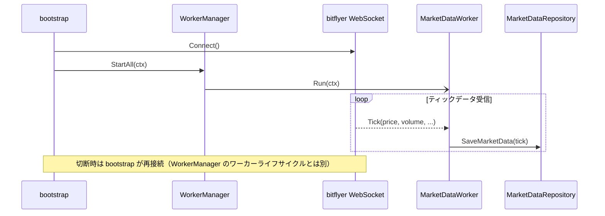
```mermaid
sequenceDiagram
    participant BS as bootstrap
    participant WM as WorkerManager
    participant WS as bitflyer WebSocket
    participant MW as MarketDataWorker
    participant DB as MarketDataRepository

    BS->>WS: Connect()
    BS->>WM: StartAll(ctx)
    WM-)MW: Run(ctx)

    loop ティックデータ受信
        WS-->>MW: Tick(price, volume, ...)
        MW->>DB: SaveMarketData(tick)
    end

    note over BS,WS: 切断時は bootstrap が再接続（WorkerManager のワーカーライフサイクルとは別）
```

### 6.4 注文タイムアウト / CANCELED・EXPIRED フロー

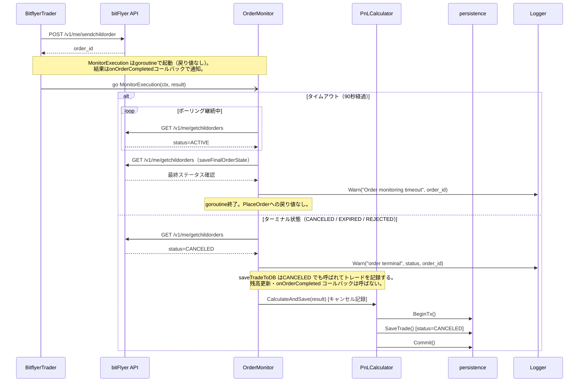
```mermaid
sequenceDiagram
    participant TR as BitflyerTrader
    participant BF as bitFlyer API
    participant OM as OrderMonitor
    participant PNL as PnLCalculator
    participant DB as persistence
    participant LOG as Logger

    TR->>BF: POST /v1/me/sendchildorder
    BF-->>TR: order_id
    note over TR,OM: MonitorExecution はgoroutineで起動（戻り値なし）。<br/>結果はonOrderCompletedコールバックで通知。
    TR-)OM: go MonitorExecution(ctx, result)

    alt タイムアウト（90秒経過）
        loop ポーリング継続中
            OM->>BF: GET /v1/me/getchildorders
            BF-->>OM: status=ACTIVE
        end
        OM->>BF: GET /v1/me/getchildorders（saveFinalOrderState）
        BF-->>OM: 最終ステータス確認
        OM->>LOG: Warn("Order monitoring timeout", order_id)
        note over OM: goroutine終了。PlaceOrderへの戻り値なし。
    else ターミナル状態（CANCELED / EXPIRED / REJECTED）
        OM->>BF: GET /v1/me/getchildorders
        BF-->>OM: status=CANCELED
        OM->>LOG: Warn("order terminal", status, order_id)
        note over OM,PNL: saveTradeToDB はCANCELED でも呼ばれてトレードを記録する。<br/>残高更新・onOrderCompleted コールバックは呼ばない。
        OM->>PNL: CalculateAndSave(result) [キャンセル記録]
        PNL->>DB: BeginTx()
        PNL->>DB: SaveTrade() [status=CANCELED]
        PNL->>DB: Commit()
    end
```

### 6.5 レート制限時のリトライフロー

```mermaid
sequenceDiagram
    participant UC as usecase
    participant BF as infra/exchange/bitflyer
    participant API as bitFlyer API

    UC->>BF: PlaceOrder(req)
    note over BF: Client.WithRetry() がリトライを管理する。<br/>usecase 層はリトライの存在を知らない。
    BF->>API: POST /v1/me/sendchildorder
    API-->>BF: 429 Too Many Requests
    loop MaxRetries 回まで（指数バックオフ）
        BF->>BF: exponential backoff 待機
        BF->>API: POST /v1/me/sendchildorder（retry）
    end
    alt リトライ成功
        API-->>BF: 200 OK
        BF-->>UC: order_id
    else リトライ上限超過
        BF-->>UC: domain.ErrRateLimitExceeded
        note over UC: errors.As(err, &apiErr) で *domain.Error に変換し<br/>apiErr.Type == domain.ErrTypeRateLimit で判定して上位に伝播させる
    end
```

### 6.6 MaintenanceWorker フロー

```mermaid
sequenceDiagram
    participant BS as bootstrap
    participant WM as WorkerManager
    participant MW as MaintenanceWorker
    participant DB as MaintenanceRepository
    participant LOG as Logger

    BS->>WM: StartAll(ctx)
    WM-)MW: Run(ctx)

    loop 定期実行（毎日深夜）
        MW->>DB: GetDatabaseSize()
        DB-->>MW: size bytes
        MW->>DB: CleanupOldData(retentionDays)
        DB-->>MW: deleted rows
        MW->>DB: GetTableStats()
        DB-->>MW: stats
        MW->>LOG: Info("maintenance done", stats)
    end

    note over MW: ctx.Done() 受信で即座に終了
```

---

## 7. 依存グラフ

```mermaid
graph LR
    cmd([cmd])

    cmd --> adp_http[adapter/http]
    cmd --> adp_worker[adapter/worker]
    cmd --> infra_bf[infra/exchange/bitflyer]
    cmd --> infra_db[infra/persistence]
    cmd --> domain([domain])

    adp_http --> uc_trading[usecase/trading]
    adp_http --> uc_analytics[usecase/analytics]
    adp_http --> domain
    adp_worker --> uc_trading
    adp_worker --> uc_strategy[usecase/strategy]
    adp_worker --> uc_risk[usecase/risk]
    adp_worker --> domain

    uc_trading --> domain
    uc_strategy --> domain
    uc_risk --> domain
    uc_analytics[usecase/analytics] --> domain

    adp_worker --> uc_analytics

    infra_bf --> domain
    infra_db --> domain
    logger --> domain
    cmd --> config[config]
    cmd --> logger
```

### CIによる依存ルール強制

```bash
# domain純粋性チェック
grep -r '"github.com/bmf-san/gogocoin' internal/domain/ && exit 1 || true

# usecase層のinfra非依存チェック
grep -rn '"github.com/bmf-san/gogocoin.*/infra/' internal/usecase/ && exit 1 || true

# adapter層のinfra非依存チェック
grep -rn '"github.com/bmf-san/gogocoin.*/infra/' internal/adapter/ && exit 1 || true
```

---

## 8. データモデル・データベース設計

### 8.1 ドメインモデルとDBテーブルの対応

| ドメインモデル | DBテーブル | 備考 |
|---|---|---|
| `Trade` | `trades` | `order_id` UNIQUE制約。bitFlyer注文IDで冪等性を保証 |
| `Position` | `positions` | `status` ∈ {OPEN, PARTIAL, CLOSED}。FIFOポジション管理 |
| `Balance` | `balances` | スナップショット履歴（上書きせず追記）。通貨ごとに複数行 |
| `MarketData` | `market_data` | UNIQUE(symbol, timestamp)。Tick + OHLCVを統合した単一モデル |
| `PerformanceMetric` | `performance_metrics` | 取引完了ごとに計算・追記する日次統計スナップショット |
| `LogEntry` | `logs` | `fields` カラムはJSON TEXT（構造化ログのkv） |
| *(key/value)* | `app_state` | `trading_enabled` 等の実行時フラグ保存。キーバリューストア |
| `OrderRequest` / `OrderResult` | **なし** | メモリ上のみ。DBには永続化しない |

### 8.2 E-Rダイアグラム

> **外部キー制約なし — 設計根拠**
>
> `positions` と `trades` の間が唯一の cross-table 論理参照だが、`PnLCalculator` が両者を**同一トランザクション内**で書き込む（BeginTx → SavePosition/UpdatePosition → SaveTrade → Commit）。トランザクションのアトミック性が FK 制約と等価の整合性を保証するため、DB レベルの FK は冗長になる。
>
> また SQLite は `PRAGMA foreign_keys = ON` を明示しない限り FK 宣言を無視するため、誤って未設定で運用すると宣言だけあって無効という状態になりやすい。
>
> **補償制御**（FK の代わりに整合性を担保するもの）
> - cross-table 書き込みは必ず単一 tx 内で完結させる（PnLCalculator の責務）
> - `trades.order_id UNIQUE` 制約で重複書き込みを防ぐ
> - `MaintenanceWorker` は `trades` を `executed_at`、CLOSED `positions` を `updated_at` 基準で `retention_days` に基づき削除する。OPEN ポジションは削除しない
>
> **運用上の注意**: DB を外部ツールや手動 SQL で直接操作する場合は整合性チェックなしで書き込めるため、必ず tx 単位で操作すること。

```mermaid
erDiagram
    TRADES {
        INTEGER id PK
        TEXT    symbol
        TEXT    side
        TEXT    type
        REAL    size
        REAL    price
        REAL    fee
        TEXT    status
        TEXT    order_id "UNIQUE"
        DATETIME executed_at
        DATETIME created_at
        DATETIME updated_at
        TEXT    strategy_name
        REAL    pnl
    }

    POSITIONS {
        INTEGER id PK
        TEXT    symbol
        TEXT    side
        REAL    size
        REAL    used_size
        REAL    remaining_size
        REAL    entry_price
        REAL    current_price
        REAL    unrealized_pl
        REAL    pnl
        TEXT    status
        TEXT    order_id
        DATETIME created_at
        DATETIME updated_at
    }

    BALANCES {
        INTEGER  id PK
        TEXT     currency
        REAL     available
        REAL     amount
        DATETIME timestamp
    }

    MARKET_DATA {
        INTEGER  id PK
        TEXT     symbol
        DATETIME timestamp
        REAL     open
        REAL     high
        REAL     low
        REAL     close
        REAL     volume
        DATETIME created_at
    }

    PERFORMANCE_METRICS {
        INTEGER  id PK
        DATETIME date
        REAL     total_return
        REAL     daily_return
        REAL     win_rate
        REAL     max_drawdown
        REAL     sharpe_ratio
        REAL     profit_factor
        INTEGER  total_trades
        INTEGER  winning_trades
        INTEGER  losing_trades
        REAL     average_win
        REAL     average_loss
        REAL     largest_win
        REAL     largest_loss
        INTEGER  consecutive_wins
        INTEGER  consecutive_loss
        REAL     total_pnl
    }

    LOGS {
        INTEGER  id PK
        TEXT     level
        TEXT     category
        TEXT     message
        TEXT     fields
        DATETIME timestamp
    }

    APP_STATE {
        TEXT     key PK
        TEXT     value
        DATETIME updated_at
    }

    POSITIONS ||--o{ TRADES : "symbol（FIFO・論理結合）"
```

### 8.3 テーブル設計の根拠

#### `trades` — 約定レコード（不変）

- `order_id UNIQUE`: bitFlyerが発行する注文IDで冪等書き込みを保証。同じ注文が2回処理されても重複しない。
- `pnl`: 約定時にPnLCalculatorが計算して書き込む。`positions` の FIFO 計算結果。
- `strategy_name`: どの戦略が発注したかを記録。パフォーマンス分析に使用。
- レコードは**不変**（UPDATE しない）。

#### `positions` — ポジション管理（FIFO）

- `size` / `used_size` / `remaining_size`: BUYで生成。SELLの約定ごとに `used_size` が増加し `remaining_size` が減少する。
- `status` 遷移: `OPEN` → `PARTIAL`（部分決済）→ `CLOSED`（全決済）。
- `UpdateStatus()` メソッドが `used_size` / `remaining_size` を見て自動設定（ドメインロジック）。
- `order_id`: 対応するBUY注文のID（FKなし、アプリレベル参照）。

#### `balances` — 残高スナップショット

- 上書きではなく**追記**（INSERTのみ）。残高履歴が時系列で残る。
- `currency`（例: `JPY`, `BTC`）単位で行を持つ。
- 最新残高は `SELECT MAX(id) FROM balances GROUP BY currency` で通貨ごとに最新行を1件ずつ取得する（`GetLatestBalances` で全通貨分を返す）。

#### `market_data` — ティック + OHLCV 統合

- UNIQUE(symbol, timestamp): 同一シンボル・同一時刻の重複書き込みを防ぐ。
- TickデータとOHLCVを `MarketData` 単一モデルに統合。WebSocketからの受信データをそのまま保存。
- MaintenanceWorkerが定期的に古いデータを削除（保持期間は設定で調整）。

#### `logs` — 構造化ログ

- `fields` はJSON TEXT。`map[string]any` を `json.Marshal` してから保存。
- `idx_logs_timestamp` (`timestamp DESC`) と `idx_logs_category` のインデックスで高速フィルタリング。
- REST API `/api/logs` からクエリされる。

#### `app_state` — 実行時フラグ

- キーバリューストア。現在のキー:
  - `trading_enabled`: `"true"` / `"false"`（取引有効/無効フラグ）
- アプリ再起動後も状態を復元する用途。

### 8.4 マイグレーション戦略

マイグレーションファイルは `internal/infra/persistence/schema/` に連番プレフィックスで管理:

```
001_initial.sql    # コアテーブル（trades, positions, balances, market_data, performance_metrics, logs）
002_indexes.sql    # クエリ性能インデックス
003_app_state.sql  # app_state テーブル
004_performance_upsert.sql  # performance_metrics UPSERT 対応
```

アプリ起動時にDB初期化コードの `Migrate()` が全ファイルを昇順に自動適用する。
冪等性は `CREATE TABLE IF NOT EXISTS` / `CREATE INDEX IF NOT EXISTS` で保証。
テーブル変更を伴う `ALTER TABLE` は冪等性を持たないため、新規マイグレーションでは `ALTER TABLE` を使わずに済む設計を優先するか、適用履歴テーブルを導入して二重適用を防ぐこと。
次回追加時は `005_` から開始する。

### 8.5 データ保持ポリシー

| テーブル | 保持ポリシー |
|---|---|
| `trades` | MaintenanceWorkerが `retention_days` 以上古いレコードを削除（`executed_at` 基準） |
| `positions` | MaintenanceWorkerが `retention_days` 以上古い CLOSED ポジションを削除（`updated_at` 基準）。OPEN は保持 |
| `balances` | MaintenanceWorkerが `retention_days` 以上古いレコードを削除 |
| `market_data` | MaintenanceWorkerが `retention_days` 以上古いレコードを削除 |
| `performance_metrics` | MaintenanceWorkerが `retention_days` 以上古いレコードを削除（`date` 基準） |
| `logs` | MaintenanceWorkerが `retention_days` 以上古いレコードを削除 |
| `app_state` | 永久保持（キーは固定・上書き更新） |


---

## 9. 稼働安定性設計

24/7稼働を前提とした実装上の判断をまとめる。

### 9.1 APIレート制限対策

bitFlyer API は分あたりのリクエスト上限が厳しく、残高照会は取引判断ループのたびに呼ばれる頻度が高い。

- **残高キャッシュ（TTL: 10秒）**: `balance` をインメモリキャッシュし、TTL内は再取得しない。429エラーを大幅に削減する
- **レートリミッター**: `infra/exchange/bitflyer/rate_limiter.go` で 1分あたりのリクエスト数を `config.api.rate_limit.requests_per_minute` で制御

### 9.2 デッドロック防止

- **個別ロック設計**: リソースごとに最小粒度のロックを持つ。取引状態の更新と残高更新は別ロックで管理
- **クリーンアップ時の競合回避**: SQLite の WAL モードはリーダーとライターを互いにブロックしない。MaintenanceWorker の DELETE と MarketDataWorker の INSERT は SQLite のトランザクション分離により安全に並行実行される。アプリケーション層での追加フラグは不要

### 9.3 ログ最適化

高頻度の DEBUG ログがそのまま DB に書き込まれると、ログテーブルが急速に肥大化しレスポンスが劣化する。

- **高頻度メッセージフィルタリング**: `logger/logger.go` の `saveToDatabase()` 内で以下の2条件を個別に判定し DB 書き込みをスキップ。stdout には引き続き出力する
  - **DEBUG レベル**（カテゴリ問わず）
  - **`data` カテゴリ**（レベル問わず。高頻度ティックデータログ対象）
- **DBインデックス最適化**: `logs.timestamp DESC` にインデックスを追加し、ログ API（直近N件取得）の応答を改善（`internal/infra/persistence/schema/002_indexes.sql`）

### 9.4 リソース管理

- **DB保持期間**: `data_retention.retention_days`（デフォルト: 1日）で古いレコードを毎日削除。詳細は [docs/DATA_MANAGEMENT.md](DATA_MANAGEMENT.md) を参照
- **低リソース消費設計**: Worker は goroutine + ticker ベースで実装し、アイドル時のCPU消費を最小化

---

## 10. API仕様

API エンドポイント・リクエスト/レスポンスの詳細は **[docs/openapi.yaml](openapi.yaml)** を単一の信頼源として管理する。

DESIGN_DOC はアーキテクチャの設計判断を記述し、API契約の詳細は openapi.yaml に委譲する。

### コード生成フロー

```
docs/openapi.yaml
       │
       │  make generate
       │  (oapi-codegen v2)
       ▼
internal/adapter/http/api.gen.go   ← 自動生成。直接編集禁止
       │
       │  *Server が StrictServerInterface を実装
       ▼
internal/adapter/http/server.go / handler_*.go
```

| ファイル | 役割 |
|---|---|
| `docs/openapi.yaml` | API契約の唯一の真実の源 |
| `internal/adapter/http/oapi-codegen.yaml` | oapi-codegen 生成設定 |
| `internal/adapter/http/api.gen.go` | 生成型・インターフェース・ルーティング |

**運用ルール**
- `docs/openapi.yaml` を変更したら必ず `make generate` を実行しコミットする
- CI の `codegen` ジョブが `make generate-check`（再生成→`git diff`）で同期を検証する
- `api.gen.go` は直接編集しない
