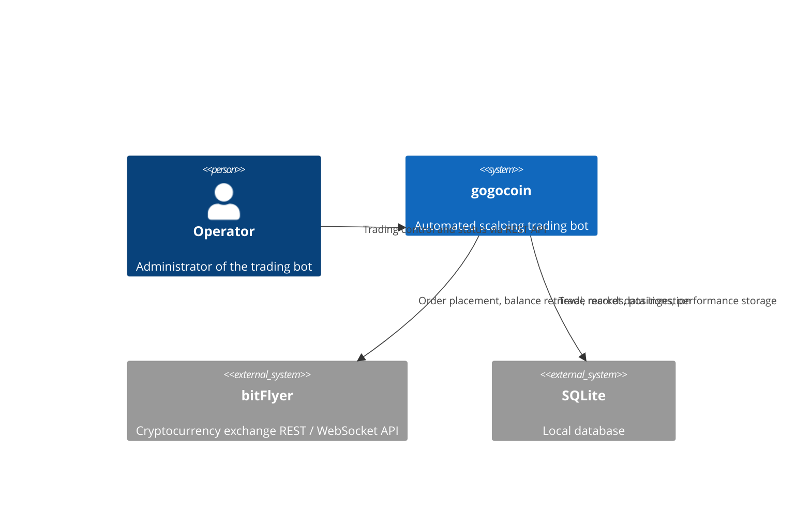
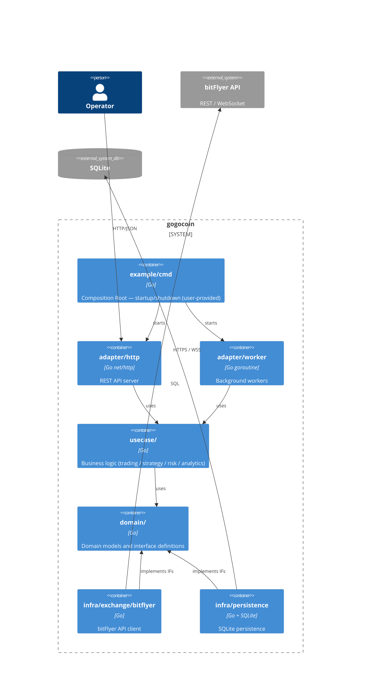
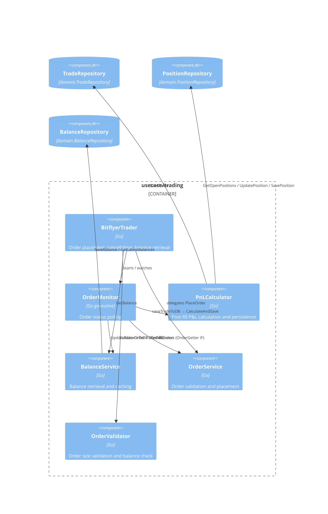
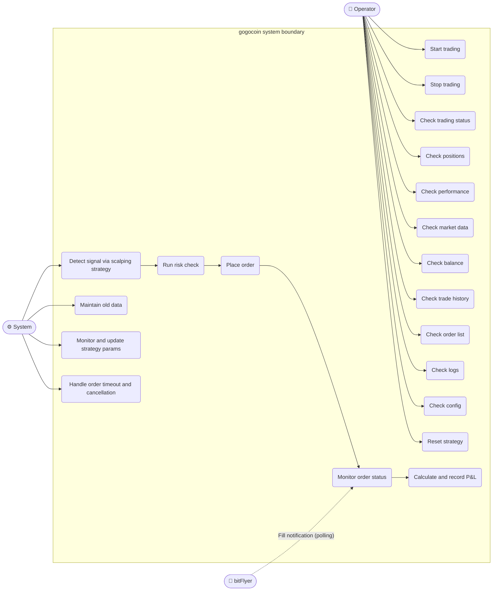
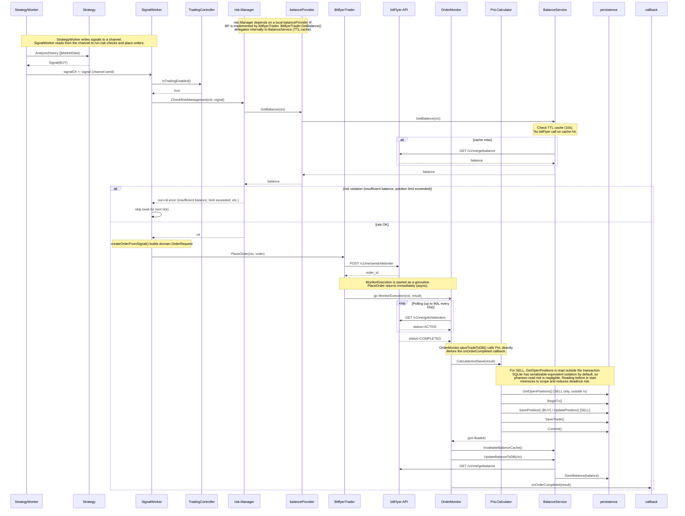
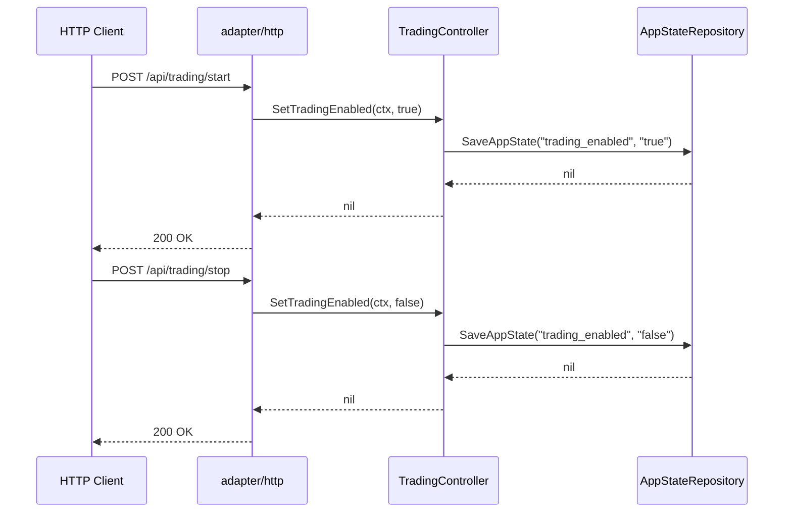
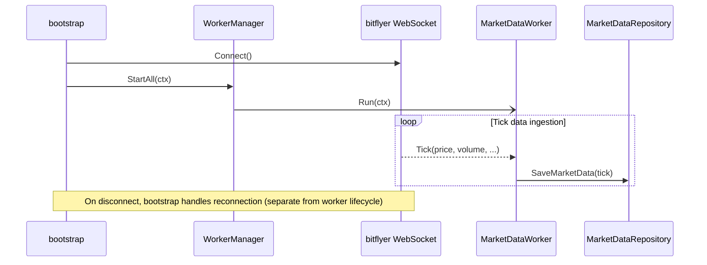
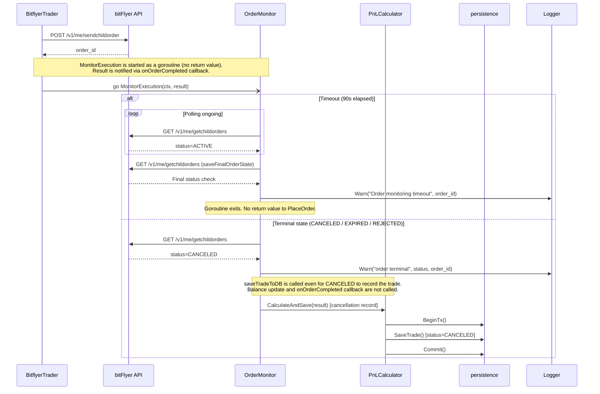
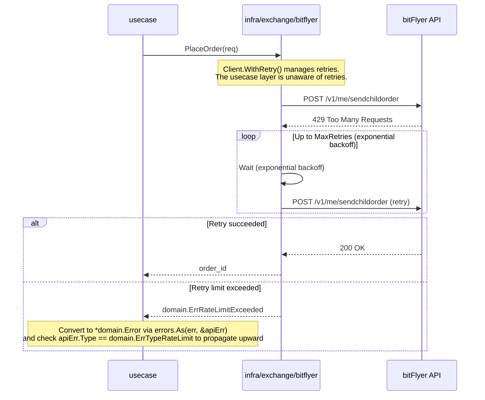
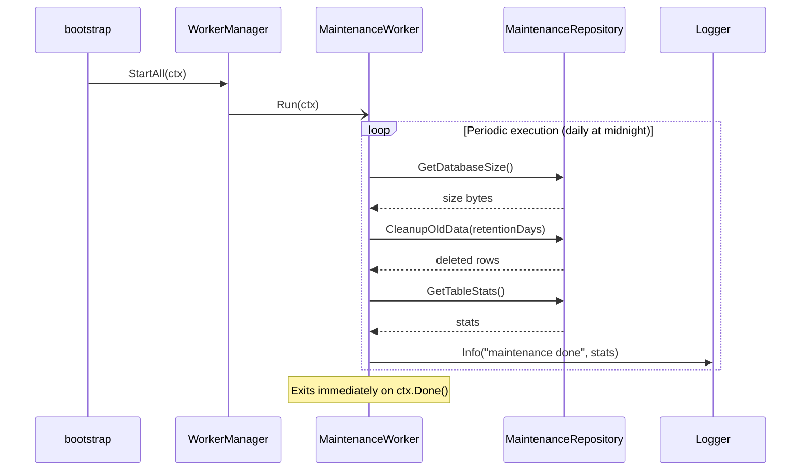

# gogocoin Architecture Design Doc

## 1. Architecture Overview

### 1.1 C4 Context — System Overview



### 1.2 C4 Container — Key Containers



### 1.3 C4 Component — usecase/trading



### Dependency Rules

| Rule | Description |
|---|---|
| `domain/` has zero internal imports | stdlib only. Knows nothing about infra or usecase |
| `usecase/` does not import `infra/` | Depends only on `domain/` interfaces |
| `adapter/` holds no concrete `infra/` types | Uses only `domain/` interfaces |
| `infra/` implements `domain/` | Knows nothing about `usecase/` or `adapter/` |
| The caller's `main` combines all packages | The sole exception as the Composition Root (lives in user repo, e.g. `example/cmd`) |

---

## 2. Directory Structure

```
gogocoin/
├── example/                  # Working sample — also the Docker entry point
│   ├── cmd/main.go           # Signal handling and engine.Run() call
│   ├── strategy/scalping/    # Bundled EMA+RSI strategy
│   ├── configs/              # Config template
│   ├── Dockerfile            # Build context: repo root
│   └── docker-compose.yml
├── internal/
│   ├── domain/               # Layer 0: Models and interface definitions
│   │   ├── trade.go
│   │   ├── position.go
│   │   ├── order.go
│   │   ├── balance.go
│   │   ├── market_data.go
│   │   ├── performance.go
│   │   ├── log.go
│   │   ├── repository.go     # Persistence interface group
│   │   ├── service.go        # Common service interfaces (MarketSpecService, etc.)
│   │   └── errors.go         # Sentinel error definitions
│   │
│   ├── usecase/              # Layer 1: Business logic (infra-independent)
│   │   ├── trading/
│   │   │   ├── interfaces.go
│   │   │   ├── trader.go
│   │   │   ├── balance/
│   │   │   ├── pnl/
│   │   │   ├── monitor/
│   │   │   ├── order/
│   │   │   └── validator/
│   │   ├── risk/
│   │   └── analytics/
│   │
│   ├── adapter/              # Layer 2: Input/output adapters
│   │   ├── http/             # REST API server
│   │   │   ├── server.go             # HTTP server and route registration
│   │   │   ├── handler_control.go    # Trading control handlers (start/stop)
│   │   │   ├── handler_data.go       # Data retrieval handlers (market/trades/positions, etc.)
│   │   │   ├── handler_status.go     # Status check handlers
│   │   │   ├── contracts.go          # Consumer-driven IFs such as TradingStateController
│   │   │   ├── api.gen.go            # Generated by oapi-codegen (do not edit directly)
│   │   │   └── oapi-codegen.yaml     # Code generation config
│   │   └── worker/           # Background workers
│   │       ├── contracts.go          # Worker / HealthChecker / Stoppable IFs
│   │       ├── manager.go            # WorkerManager (start, stop, health of all workers)
│   │       ├── market_data.go        # MarketDataWorker
│   │       ├── strategy_worker.go    # StrategyWorker
│   │       ├── signal_worker.go      # SignalWorker
│   │       ├── maintenance.go        # MaintenanceWorker
│   │       └── strategy_monitor.go   # StrategyMonitorWorker
│   │
│   ├── infra/                # Layer 3: Infrastructure implementations
│   │   ├── exchange/
│   │   │   └── bitflyer/     # bitFlyer API client
│   │   └── persistence/      # SQLite persistence
│   │       ├── db.go                 # DB connection only
│   │       ├── migrate.go            # Migration application
│   │       ├── repository.go         # RepositoryFacade (aggregates all repositories)
│   │       ├── transaction.go        # TransactionManager implementation
│   │       ├── trade_repo.go
│   │       ├── position_repo.go
│   │       ├── balance_repo.go
│   │       ├── market_data_repo.go
│   │       ├── performance_repo.go
│   │       ├── log_repo.go
│   │       ├── app_state_repo.go
│   │       ├── maintenance_repo.go
│   │       └── schema/               # Migration SQL files
│   │
│   ├── config/               # Cross-cutting concern (config loading and validation)
│   └── logger/               # Cross-cutting concern (structured logging and DB integration)
│
├── pkg/                      # Public API (subject to semantic versioning)
│   ├── engine/
│   │   ├── engine.go         # Run() / RunWithLogger()
│   │   └── options.go        # WithStrategy() / WithConfigPath()
│   └── strategy/
│       ├── strategy.go       # Strategy interface
│       ├── signal.go         # Signal type (BUY / SELL / HOLD)
│       ├── market_data.go    # MarketData type
│       ├── metrics.go        # StrategyMetrics / StrategyStatus types
│       ├── base.go           # BaseStrategy (common fields and default implementations)
│       ├── registry.go       # Registry (ctor registration and lookup)
│       └── scalping/         # Bundled default strategy
```

---

## 3. Interface Design

### Where to Define Interfaces

| Kind | Definition location | Example |
|---|---|---|
| Data persistence IFs | `domain/repository.go` | `TradeRepository`, `PositionRepository` |
| Common service IFs used across packages | `domain/service.go` | `MarketSpecService` |
| Behavioral IFs between specific services | Consumer-driven (defined in the consuming package) | `worker.RiskChecker`, `http.TradingStateController` |

### `domain/service.go`

```go
package domain

// MarketSpecService provides exchange-specific market specifications.
type MarketSpecService interface {
    GetMinimumOrderSize(symbol string) (float64, error)
}
```

### Error definitions in `domain/errors.go`

The current `domain/errors.go` uses a struct-based `*Error` with `ErrType` classification and `Unwrap()`.

```go
// ErrType classifies error categories
const (
    ErrTypeRateLimit ErrType = "rate_limit"
    ErrTypeNetwork   ErrType = "network"
    // ...
)

// sentinels are of type *domain.Error
var ErrRateLimitExceeded = NewError(ErrTypeRateLimit, "rate limit exceeded", nil)

// Callers use errors.As() to type-assert and check ErrType
if apiErr := new(domain.Error); errors.As(err, &apiErr) {
    if apiErr.Type == domain.ErrTypeRateLimit { /* handle */ }
}
```

`infra/exchange/bitflyer/` returns `domain.ErrRateLimitExceeded` directly or wrapped.
`usecase/` and `adapter/` use `errors.As()` to convert to `*domain.Error` and check `ErrType`, allowing error classification without knowing the bitflyer package.

---

## 4. Component Design

### 4.1 Composition Root

The Composition Root lives in the **caller's repository** (e.g. `example/cmd/main.go`, `my-gogocoin/cmd/main.go`). gogocoin itself is a library; it does not ship a `cmd/` directory.

A typical entry point:

```go
// example/cmd/main.go
package main

import (
    "github.com/bmf-san/gogocoin/pkg/engine"
    _ "github.com/yourname/your-bot/strategy/scalping" // triggers init()
)

func main() {
    engine.Run(ctx, engine.WithConfigPath("./configs/config.yaml"))
}
```

`engine.Run()` internally wires all services. A sketch of what happens inside:

```go
// bootstrap.go sketch
db, _        := persistence.NewDB(cfg.Database.Path)
tradeRepo    := persistence.NewTradeRepository(db)
positionRepo := persistence.NewPositionRepository(db)
// db also implements TransactionManager (BeginTx)
pnlCalc := pnl.NewCalculator(tradeRepo, positionRepo, db, log, strategyName)
trader  := trading.NewBitflyerTrader(bfClient, pnlCalc, log)
// ...
```

The bitFlyer WebSocket reconnection loop is also managed in `bootstrap.go`.
The `usecase/` layer knows nothing about connection management.

```go
// bootstrap.go sketch (reconnection loop)
go func() {
    for {
        if err := ws.Connect(ctx); err != nil {
            if ctx.Err() != nil { return }
        }
        // Same interval for both normal and error disconnects
        if ctx.Err() != nil { return }
        time.Sleep(reconnectInterval)
    }
}()
```

### 4.2 TradingController (`cmd/gogocoin/trading_ctrl.go`)

Manages the enabled/disabled state of trading. Interfaces are defined consumer-driven in each adapter package, and `cmd/gogocoin/trading_ctrl.go` provides the implementation. This preserves the dependency direction so that the adapter layer does not directly reference the cmd layer.

```go
// adapter/http/contracts.go (consumer-driven)
type TradingStateController interface {
    IsTradingEnabled() bool
    SetTradingEnabled(ctx context.Context, enabled bool) error
}

// adapter/worker/contracts.go (consumer-driven)
type TradingStateReader interface {
    IsTradingEnabled() bool
}

// cmd/gogocoin/trading_ctrl.go (sole implementation)
type TradingController struct {
    mu      sync.RWMutex
    enabled bool
    db      domain.AppStateRepository
    logger  logger.LoggerInterface
}

func (tc *TradingController) IsTradingEnabled() bool
func (tc *TradingController) SetTradingEnabled(ctx context.Context, enabled bool) error
```

`cmd/bootstrap.go` reads `trading_enabled` from the DB on startup and initializes the `enabled` field.
The previous trading state is preserved across restarts.

`cmd/bootstrap.go` creates a `*TradingController` and injects it into `adapter/http.Server` and
`adapter/worker.SignalWorker` as their respective interface types.

### 4.3 persistence (`infra/persistence/`)

#### Aggregate design rationale

Repository interfaces in `domain/` are defined based on **aggregate boundaries**.

| Aggregate root | Lifecycle | Repository IF |
|---|---|---|
| `Trade` | Created on fill. Immutable. | `TradeRepository` |
| `Position` | Created on BUY, updated by multiple SELLs (FIFO), terminated on CLOSED. Lifecycle independent of `Trade`. | `PositionRepository` |
| `Balance` | Balance snapshot. Append-only on order completion (INSERT only). Reads return only the latest snapshot. | `BalanceRepository` (SaveBalance / GetLatestBalances) |
| `MarketData` | Time-series data. Written continuously by workers. Also readable via REST API. | `MarketDataRepository` |
| `PerformanceMetric` | Statistical snapshot calculated and appended after each trade. Also provides latest value retrieval. | `PerformanceRepository` (SavePerformanceMetric / GetLatestPerformanceMetric) |
| `PerformanceMetric` (analytics) | Read-only for daily aggregations. Writes delegated to `PerformanceRepository`. | `AnalyticsRepository` (GetPerformanceMetrics(days int) only) · **consumer-driven, defined in usecase/analytics** |
| `LogEntry` | Persistent application event log. Also exposed via REST API `GET /api/logs`. | `LogRepository` (SaveLog / GetRecentLogsWithFilters) |
| `AppState` | KV store. Infrastructure concern. | `AppStateRepository` |

PnL Calculator is a use case that **atomically updates both Trade and Position across aggregates**.
Rather than a `domain.TradingRepository` composite IF, it accepts **individual repositories + `TransactionManager`** separately.
The `domain.TradingRepository` composite IF is deprecated.

```go
// usecase/trading/pnl/calculator.go
func NewCalculator(
    tradeRepo    domain.TradeRepository,
    positionRepo domain.PositionRepository,
    txMgr        domain.TransactionManager,  // Atomically saves Trade+Position via BeginTx()
    log          logger.LoggerInterface,
    strategyName string,
) *Calculator
```

> **Note**: `BalanceRepository` is outside PnL Calculator's responsibility. Balance updates are performed by `OrderMonitor` via `BalanceUpdater.UpdateBalanceToDB()` (after PnL save completes).

Independent implementations are created in `cmd/bootstrap.go` and injected. No composite IF wrapper is needed.

#### Implementation structure

DB connection (`db.go`) and repository implementations are separated.
Each repository struct accepts `*DB` and implements the interfaces in `domain/repository.go`.

```go
// db.go: connection management + TransactionManager + DatabaseLifecycle implementation
type DB struct{ conn *sql.DB }
func (db *DB) Close() error                          // domain.DatabaseLifecycle
func (db *DB) Ping() error                           // domain.DatabaseLifecycle
func (db *DB) BeginTx() (domain.Transaction, error)  // domain.TransactionManager

// trade_repo.go
type TradeRepository struct{ db *DB }
func NewTradeRepository(db *DB) *TradeRepository
func (r *TradeRepository) SaveTrade(trade *domain.Trade) error
func (r *TradeRepository) GetRecentTrades(limit int) ([]domain.Trade, error)
```

Similarly, `PositionRepository`, `BalanceRepository`, `MarketDataRepository`,
`PerformanceRepository`, `LogRepository`, `AppStateRepository`, `MaintenanceRepository`
are each defined as independent structs.

`TransactionManager` is implemented directly by `*persistence.DB` (returning `domain.Transaction`).

### 4.4 usecase/risk

`risk.Manager` does not depend on the `config` package. It uses its own parameter type extracted from `config.RiskManagementConfig` and `config.TradingConfig` (same pattern as § 4.5 strategy).

Balance retrieval uses a consumer-driven local interface, avoiding any dependency on `usecase/trading`.
`TradingRepository` / `AnalyticsRepository` are also defined as consumer-driven local IFs.

```go
// usecase/risk/manager.go

// ManagerConfig holds risk management parameters. Does not depend on the config package.
// Converted from config.RiskManagementConfig / config.TradingConfig in cmd/bootstrap.go and injected.
type ManagerConfig struct {
    MaxTotalLossPercent   float64
    MaxTradeLossPercent   float64
    MaxDailyLossPercent   float64
    MaxTradeAmountPercent float64
    MaxDailyTrades        int
    MinTradeInterval      time.Duration
    FeeRate               float64
    InitialBalance        float64
}

// TradingRepository is the minimal IF for recent trade retrieval
type TradingRepository interface {
    GetRecentTrades(limit int) ([]domain.Trade, error)
}

// AnalyticsRepository is the minimal IF for performance metric retrieval
type AnalyticsRepository interface {
    GetPerformanceMetrics(days int) ([]domain.PerformanceMetric, error)
}

type Manager struct {
    cfg           ManagerConfig
    tradingRepo   TradingRepository
    analyticsRepo AnalyticsRepository
    trader        trading.Trader
    logger        logger.LoggerInterface
}
```

---

## 5. Pluggable Strategy Architecture (`pkg/`)

gogocoin exposes a **`pkg/`** public API so that repository users can inject their own trading strategies.
`internal/` cannot be imported from outside, but `pkg/` is treated as a stable, semantically versioned API.

```
pkg/
├── engine/
│   ├── engine.go   # Run() / RunWithLogger()
│   └── options.go  # WithStrategy() / WithConfigPath()
└── strategy/
    ├── strategy.go     # Strategy interface
    ├── signal.go       # Signal type (BUY / SELL / HOLD)
    ├── market_data.go  # MarketData type
    ├── metrics.go      # StrategyMetrics / StrategyStatus types
    ├── base.go         # BaseStrategy (common fields and default implementations)
    ├── registry.go     # Registry (ctor registration and lookup)
    └── scalping/       # Bundled default strategy
```

### 5.1 `pkg/strategy.Strategy` Interface

```go
type Strategy interface {
    // Signal generation
    GenerateSignal(ctx context.Context, data *MarketData, history []MarketData) (*Signal, error)
    Analyze(data []MarketData) (*Signal, error)

    // Lifecycle
    Start(ctx context.Context) error
    Stop(ctx context.Context) error
    IsRunning() bool
    GetStatus() StrategyStatus
    Reset() error

    // Metrics and trade counts
    GetMetrics() StrategyMetrics
    RecordTrade()
    InitializeDailyTradeCount(count int)

    // Configuration
    Name() string
    Description() string
    Version() string
    Initialize(config map[string]interface{}) error   // Receives the strategy_params.<name> block from config.yaml
    UpdateConfig(config map[string]interface{}) error
    GetConfig() map[string]interface{}
}
```

### 5.2 How to Implement a Custom Strategy

**1. Create a separate repository and add gogocoin to `go.mod`**

```bash
go get github.com/bmf-san/gogocoin@latest
```

**2. Embed `pkg/strategy.BaseStrategy` and implement the strategy**

`BaseStrategy` provides default implementations for lifecycle (Start/Stop/IsRunning/GetStatus/Reset),
trade counting (RecordTrade/InitializeDailyTradeCount), and metrics.

```go
package mystrategy

import (
    "context"

    "github.com/bmf-san/gogocoin/pkg/strategy"
)

type MyStrategy struct {
    strategy.BaseStrategy
    // strategy-specific fields
}

func New() strategy.Strategy { return &MyStrategy{} }

func (s *MyStrategy) Name() string        { return "mystrategy" }
func (s *MyStrategy) Description() string { return "My custom strategy" }
func (s *MyStrategy) Version() string     { return "0.1.0" }

func (s *MyStrategy) Initialize(cfg map[string]interface{}) error {
    // Receives the strategy_params.mystrategy block from config.yaml
    return nil
}

func (s *MyStrategy) UpdateConfig(cfg map[string]interface{}) error { return s.Initialize(cfg) }
func (s *MyStrategy) GetConfig() map[string]interface{}             { return nil }

func (s *MyStrategy) GenerateSignal(
    ctx context.Context,
    data *strategy.MarketData,
    history []strategy.MarketData,
) (*strategy.Signal, error) {
    // Signal logic
    return &strategy.Signal{Action: strategy.Hold}, nil
}

func (s *MyStrategy) Analyze(data []strategy.MarketData) (*strategy.Signal, error) {
    return &strategy.Signal{Action: strategy.Hold}, nil
}
```

**3. Implement the entry point with `engine.Run()`**

```go
package main

import (
    "context"
    "os"
    "os/signal"
    "syscall"

    "github.com/bmf-san/gogocoin/pkg/engine"
    pkgstrategy "github.com/bmf-san/gogocoin/pkg/strategy"
    "example.com/myrepo/mystrategy"
)

func main() {
    ctx, stop := signal.NotifyContext(context.Background(), os.Interrupt, syscall.SIGTERM)
    defer stop()

    if err := engine.Run(ctx,
        engine.WithStrategy("mystrategy", func() pkgstrategy.Strategy { return mystrategy.New() }),
        engine.WithConfigPath("./configs/config.yaml"),
    ); err != nil {
        os.Exit(1)
    }
}
```

**4. Specify the strategy name in `config.yaml`**

```yaml
trading:
  strategy:
    name: "mystrategy"   # Must match the first argument of WithStrategy()

strategy_params:
  mystrategy:            # Key of the map passed to Initialize()
    my_param: 42
```

### 5.3 Internal flow of `pkg/engine.Run()`

```
engine.Run(ctx, opts...)
  └─ config.Load()                    # Load configPath
  └─ logger.New()                     # Initialize structured logger
  └─ run(ctx, cfg, log, ec)
       ├─ persistence.NewDB()         # SQLite connection and migration
       ├─ bitflyer.NewClient()        # bitFlyer API client
       ├─ registry.Get(cfg.trading.strategy.name)
       │    └─ Constructor()          # Calls the ctor registered via WithStrategy()
       ├─ strategy.Initialize(strategyParams)
       ├─ WorkerManager.Start()       # Starts MarketDataWorker / StrategyWorker / etc.
       ├─ HTTPServer.Start()          # REST API + Web UI
       └─ <ctx.Done()> → graceful shutdown
```

### 5.4 Bundled strategy: `pkg/strategy/scalping`

EMA crossover + RSI filter scalping strategy.
Register via `engine.WithStrategy("scalping", scalping.NewDefault)`.
For detailed parameters see [pkg/strategy/scalping/README.md](../pkg/strategy/scalping/README.md).

### 4.6 WorkerManager (`adapter/worker/`)

`WorkerManager` manages the lifecycle of all background workers.
`cmd/bootstrap.go` creates workers, registers them with `WorkerManager`, and starts/stops them together.

```go
// adapter/worker/contracts.go
type Worker interface {
    Run(ctx context.Context) error  // blocking until ctx is cancelled
    Name() string
}

// HealthStatus represents the operational state of a worker.
type HealthStatus struct {
    Running   bool
    LastError error
    LastCheck time.Time
}

// adapter/worker/manager.go
type WorkerManager struct {
    workers      map[string]Worker
    workerOrder  []string  // Preserves registration order. StartAll launches goroutines in this order.
    logger       logger.LoggerInterface
    // ...
}

func NewWorkerManager(logger logger.LoggerInterface) *WorkerManager
func (m *WorkerManager) Register(name string, worker Worker) error  // Duplicate names or post-StartAll registration returns error.
func (m *WorkerManager) StartAll(ctx context.Context) error
func (m *WorkerManager) StopAll() error
func (m *WorkerManager) HealthCheck() map[string]HealthStatus
```

Registered workers:

| Worker | Role |
|---|---|
| `MarketDataWorker` | Receives tick data from WebSocket and saves to DB |
| `StrategyWorker` | Receives from marketDataCh, generates signals, enforces engine-level stop loss, sends to signalCh |
| `SignalWorker` | Receives from signalCh, runs risk checks, and places orders |
| `MaintenanceWorker` | Periodically deletes old data from the DB |
| `StrategyMonitorWorker` | Checks strategy health every 5 minutes |

### 4.7 logger

All Worker constructors accept `logger.LoggerInterface`.
Type assertions to `*logger.Logger` are not performed.

`logger.LoggerInterface` provides:
- **Category loggers**: `System()`, `Trading()`, `API()`, `Strategy()`, `UI()`, `Data()`, `Category(string)`
- **Field helpers**: `WithFields()`, `WithField()`, `WithError()`
- **Dedicated log methods**: `LogTrade()`, `LogAPICall()`, `LogStrategySignal()`, `LogError()`, `LogPerformance()`, `LogStartup()`, `LogShutdown()`
- **Basic method**: `Error(msg string)`
- **Lifecycle**: `Flush()`, `Close() error`, `SetLevel() error`, `GetLevel() string`
- **DB integration**: `SetDatabase(domain.LogRepository)`

The mock implementation for tests is centralized in `logger/testing.go`.
Tests in each package import it (following the `net/http/httptest` pattern from the stdlib).

```go
// logger/testing.go
package logger

import (
    "io"
    "log/slog"

    "github.com/bmf-san/gogocoin/v1/internal/domain"
)

// nopSlog is a no-op slog.Logger targeting io.Discard. Used as the return value of WithFields etc.
// Returning nil would panic when calling Info() etc. on the result, so a discard-handler Logger
// is returned to guarantee safe method chaining.
var nopSlog = slog.New(slog.NewTextHandler(io.Discard, nil))

// NopLogger is a test-only implementation that produces no output.
// Implements all methods of LoggerInterface.
type NopLogger struct{}

func (n *NopLogger) System() *ExtendedLogger                                                     { return &NopExtendedLogger{} }
func (n *NopLogger) Trading() *ExtendedLogger                                                    { return &NopExtendedLogger{} }
func (n *NopLogger) API() *ExtendedLogger                                                        { return &NopExtendedLogger{} }
func (n *NopLogger) Strategy() *ExtendedLogger                                                   { return &NopExtendedLogger{} }
func (n *NopLogger) UI() *ExtendedLogger                                                         { return &NopExtendedLogger{} }
func (n *NopLogger) Data() *ExtendedLogger                                                       { return &NopExtendedLogger{} }
func (n *NopLogger) Category(category string) *ExtendedLogger                                    { return &NopExtendedLogger{} }
func (n *NopLogger) WithFields(fields map[string]any) *slog.Logger                               { return nopSlog }
func (n *NopLogger) WithField(key string, value any) *slog.Logger                                { return nopSlog }
func (n *NopLogger) WithError(err error) *slog.Logger                                            { return nopSlog }
func (n *NopLogger) LogTrade(action, symbol string, price, qty float64, f map[string]any)        {}
func (n *NopLogger) LogAPICall(method, ep string, dur int64, code int, err error)                {}
func (n *NopLogger) LogStrategySignal(strategy, sym, action string, s float64, m map[string]any) {}
func (n *NopLogger) LogError(cat, op string, err error, f map[string]any)                        {}
func (n *NopLogger) LogPerformance(op string, dur int64, f map[string]any)                       {}
func (n *NopLogger) LogStartup(version string, config map[string]any)                            {}
func (n *NopLogger) LogShutdown(reason string)                                                   {}
func (n *NopLogger) Error(msg string)                                                            {}
func (n *NopLogger) SetDatabase(db domain.LogRepository)                                         {}
func (n *NopLogger) Flush()                                                                      {}
func (n *NopLogger) Close() error                                                                { return nil }
func (n *NopLogger) SetLevel(level string) error                                                 { return nil }
func (n *NopLogger) GetLevel() string                                                            { return "" }

var _ LoggerInterface = (*NopLogger)(nil) // compile-time check
```

> Category logger methods (`System()` etc.) return `&NopExtendedLogger{}`, not `nil`.
> `WithFields` / `WithField` / `WithError` return `nopSlog` (a `*slog.Logger` targeting `io.Discard`), not `nil`.
> This allows safe method chaining such as `n.System().Info(...)` or `n.WithField("k", "v").Info(...)`.
> `NopExtendedLogger` is a dedicated type implementing all methods of `*ExtendedLogger` as no-ops.
> The compile-time check `var _ LoggerInterface = (*NopLogger)(nil)` guarantees completeness.

### 4.8 usecase/analytics

Use case layer responsible for aggregating and analyzing performance metrics.

Read-only use case for external consumers, independent of the `PerformanceRepository` (write and latest-value retrieval flow).
Called from the `adapter/http` `/api/performance` endpoint.

```go
// usecase/analytics/analyzer.go

// AnalyticsRepository is a read-only consumer-driven IF.
// Separated from domain.PerformanceRepository to avoid write contention.
type AnalyticsRepository interface {
    GetPerformanceMetrics(days int) ([]domain.PerformanceMetric, error)
}

type Analyzer struct {
    repo   AnalyticsRepository
    logger logger.LoggerInterface
}

func NewAnalyzer(repo AnalyticsRepository, log logger.LoggerInterface) *Analyzer
func (a *Analyzer) GetMetrics(ctx context.Context, days int) ([]domain.PerformanceMetric, error)
```

In `cmd/bootstrap.go`, `infra/persistence.PerformanceRepository` (which implements both `PerformanceRepository` and `AnalyticsRepository`) is created and injected for each use.

---

## 5. Use Case Diagram



---

## 6. Sequence Diagrams

### 6.1 Scalping Trade Flow



### 6.2 REST API Trading Control Flow



### 6.3 Market Data Collection Flow



### 6.4 Order Timeout / CANCELED / EXPIRED Flow



### 6.5 Rate Limit Retry Flow



### 6.6 MaintenanceWorker Flow



---

## 7. Dependency Graph


### CI-enforced dependency rules

```bash
# Verify domain purity
grep -r '"github.com/bmf-san/gogocoin' internal/domain/ && exit 1 || true

# Verify usecase layer does not import infra
grep -rn '"github.com/bmf-san/gogocoin.*/infra/' internal/usecase/ && exit 1 || true

# Verify adapter layer does not import infra
grep -rn '"github.com/bmf-san/gogocoin.*/infra/' internal/adapter/ && exit 1 || true
```

---

## 8. Data Model and Database Design

### 8.1 Domain Model to DB Table Mapping

| Domain model | DB table | Notes |
|---|---|---|
| `Trade` | `trades` | `order_id` UNIQUE constraint. Idempotency guaranteed by bitFlyer order ID |
| `Position` | `positions` | `status` ∈ {OPEN, PARTIAL, CLOSED}. FIFO position management |
| `Balance` | `balances` | Snapshot history (append-only, never overwritten). Multiple rows per currency |
| `MarketData` | `market_data` | UNIQUE(symbol, timestamp). Unified tick + OHLCV model |
| `PerformanceMetric` | `performance_metrics` | Daily statistical snapshot calculated and appended after each trade |
| `LogEntry` | `logs` | `fields` column is JSON TEXT (structured log key-value pairs) |
| *(key/value)* | `app_state` | KV store for runtime flags such as `trading_enabled`. Fixed-key upserts |
| `OrderRequest` / `OrderResult` | **none** | In-memory only. Not persisted to DB |

### 8.2 E-R Diagram

> **No foreign key constraints — design rationale**
>
> The only cross-table logical reference is between `positions` and `trades`, but `PnLCalculator`
> writes both **within the same transaction** (BeginTx → SavePosition/UpdatePosition → SaveTrade → Commit).
> The atomicity of the transaction provides the same integrity guarantee as FK constraints, making DB-level FKs redundant.
>
> Additionally, SQLite ignores FK declarations unless `PRAGMA foreign_keys = ON` is explicitly set,
> making it easy to accidentally run with FKs declared but not enforced.
>
> **Compensating controls** (in place of FK constraints)
> - All cross-table writes complete within a single tx (PnLCalculator's responsibility)
> - `trades.order_id UNIQUE` constraint prevents duplicate writes
> - `MaintenanceWorker` deletes `trades` by `executed_at` and closed `positions` by `updated_at` based on `retention_days`. OPEN positions are never deleted.
>
> **Operational note**: When directly manipulating the DB with external tools or manual SQL, writes are performed without integrity checks. Always operate within a transaction.


### 8.3 Table Design Rationale

#### `trades` — Fill records (immutable)

- `order_id UNIQUE`: Guarantees idempotent writes using the bitFlyer-issued order ID. Duplicate order processing cannot create duplicate records.
- `pnl`: Calculated by PnLCalculator on fill and written here. Result of FIFO calculation against `positions`.
- `strategy_name`: Records which strategy placed the order. Used for performance analysis.
- Records are **immutable** (never UPDATEd).

#### `positions` — Position management (FIFO)

- `size` / `used_size` / `remaining_size`: Created on BUY. `used_size` increases and `remaining_size` decreases on each SELL fill.
- `status` transitions: `OPEN` → `PARTIAL` (partial close) → `CLOSED` (fully closed).
- `UpdateStatus()` method automatically sets status based on `used_size` / `remaining_size` (domain logic).
- `order_id`: Corresponding BUY order ID (no FK; application-level reference).

#### `balances` — Balance snapshots

- **Append-only** (INSERT only, never overwritten). Balance history remains as a time series.
- One row per `currency` (e.g., `JPY`, `BTC`).
- Latest balance is retrieved with `SELECT MAX(id) FROM balances GROUP BY currency` (`GetLatestBalances` returns the latest row per currency).

#### `market_data` — Tick + OHLCV unified

- UNIQUE(symbol, timestamp): Prevents duplicate writes for the same symbol and timestamp.
- Tick data and OHLCV unified into a single `MarketData` model. WebSocket data is stored as received.
- `MaintenanceWorker` periodically deletes old data (retention period is configurable).

#### `logs` — Structured logs

- `fields` is JSON TEXT. `map[string]any` is `json.Marshal`ed before storage.
- Fast filtering via `idx_logs_timestamp` (`timestamp DESC`) and `idx_logs_category` indexes.
- Queried by REST API `/api/logs`.

#### `app_state` — Runtime flags

- KV store. Current keys:
  - `trading_enabled`: `"true"` / `"false"` (trading enabled/disabled flag)
- Used to restore state after application restart.

### 8.4 Migration Strategy

Migration files are managed in `internal/infra/persistence/schema/` with sequential numeric prefixes:

```
001_initial.sql    # Core tables (trades, positions, balances, market_data, performance_metrics, logs)
002_indexes.sql    # Query performance indexes
003_app_state.sql  # app_state table
004_performance_upsert.sql  # performance_metrics UPSERT support
```

`Migrate()` in the DB initialization code automatically applies all files in ascending order at startup.
Idempotency is ensured by `CREATE TABLE IF NOT EXISTS` / `CREATE INDEX IF NOT EXISTS`.
`ALTER TABLE` statements are not idempotent, so prefer designs that avoid them in new migrations, or introduce a migration history table to prevent double-application.
The next migration should start with `005_`.

### 8.5 Data Retention Policy

| Table | Retention policy |
|---|---|
| `trades` | `MaintenanceWorker` deletes records older than `retention_days` (by `executed_at`) |
| `positions` | `MaintenanceWorker` deletes closed positions older than `retention_days` (by `updated_at`). OPEN positions are never deleted |
| `balances` | `MaintenanceWorker` deletes records older than `retention_days` |
| `market_data` | `MaintenanceWorker` deletes records older than `retention_days` |
| `performance_metrics` | `MaintenanceWorker` deletes records older than `retention_days` (by `date`) |
| `logs` | `MaintenanceWorker` deletes records older than `retention_days` |
| `app_state` | Retained permanently (fixed keys, upsert only) |


---

## 9. Operational Stability Design

Design decisions for continuous 24/7 operation.

### 9.1 API Rate Limit Mitigation

The bitFlyer API has strict per-minute request limits, and balance queries are called frequently in the trading loop.

- **Balance cache (TTL: 10s)**: `balance` is cached in memory; no re-fetch within TTL. Significantly reduces 429 errors.
- **Rate limiter**: `infra/exchange/bitflyer/rate_limiter.go` controls requests per minute via `config.api.rate_limit.requests_per_minute`.

### 9.2 Deadlock Prevention

- **Per-resource lock design**: Minimum-granularity locks per resource. Trading state updates and balance updates use separate locks.
- **Cleanup concurrency safety**: SQLite WAL mode does not block readers and writers from each other. `MaintenanceWorker` DELETEs and `MarketDataWorker` INSERTs are safely concurrent due to SQLite transaction isolation. No additional application-level flags are needed.

### 9.3 Log Optimization

High-frequency DEBUG logs written directly to the DB would cause the log table to grow rapidly and degrade response times.

- **High-frequency message filtering**: In `logger/logger.go`'s `saveToDatabase()`, the following two conditions are individually checked and DB writes are skipped. stdout output continues unaffected.
  - **DEBUG level** (regardless of category)
  - **`data` category** (regardless of level — targets high-frequency tick data logs)
- **DB index optimization**: An index on `logs.timestamp DESC` is added for fast log API responses (latest N records) (`internal/infra/persistence/schema/002_indexes.sql`).

### 9.4 Resource Management

- **DB retention period**: `data_retention.retention_days` (example default: 90 days; code fallback: 1 day) deletes old records daily. See [docs/DATA_MANAGEMENT.md](DATA_MANAGEMENT.md) for details.
- **Low resource consumption design**: Workers use goroutines + ticker-based loops to minimize CPU usage when idle.

---

## 10. API Specification

API endpoints and request/response details are managed in **[docs/openapi.yaml](openapi.yaml)** as the single source of truth.

DESIGN_DOC describes architectural decisions; API contract details are delegated to openapi.yaml.

### Code generation flow

```
docs/openapi.yaml
       │
       │  make generate
       │  (oapi-codegen v2)
       ▼
internal/adapter/http/api.gen.go   ← Auto-generated. Do not edit directly.
       │
       │  *Server implements StrictServerInterface
       ▼
internal/adapter/http/server.go / handler_*.go
```

| File | Role |
|---|---|
| `docs/openapi.yaml` | Single source of truth for the API contract |
| `internal/adapter/http/oapi-codegen.yaml` | oapi-codegen generation config |
| `internal/adapter/http/api.gen.go` | Generated types, interfaces, and routing |

**Operational rules**
- After modifying `docs/openapi.yaml`, always run `make generate` and commit the result.
- The CI `codegen` job verifies sync via `make generate-check` (re-generate → `git diff`).
- Never edit `api.gen.go` directly.

